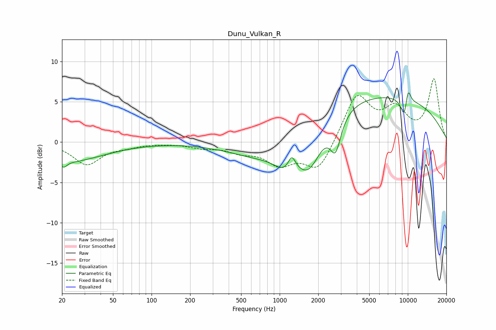

# Dunu_Vulkan_R
See [usage instructions](https://github.com/jaakkopasanen/AutoEq#usage) for more options and info.

### Parametric EQs
Apply preamp of -6.2 dB when using parametric equalizer.

|   # | Type    |   Fc (Hz) |    Q |   Gain (dB) |
|-----|---------|-----------|------|-------------|
|   1 | Peaking |        21 | 5.48 |        -0.7 |
|   2 | Peaking |        22 | 0.49 |        -2.4 |
|   3 | Peaking |       797 | 0.55 |        -3.1 |
|   4 | Peaking |      1104 | 1.62 |        -2.2 |
|   5 | Peaking |      1243 | 4.91 |         1.8 |
|   6 | Peaking |      1694 | 1.36 |        -5.5 |
|   7 | Peaking |      2730 | 3.32 |        -4.1 |
|   8 | Peaking |      5122 | 0.18 |         6.1 |
|   9 | Peaking |      9445 | 4.34 |        -3   |
|  10 | Peaking |     10000 | 5.58 |         2.7 |

### Fixed Band EQs
When using fixed band (also called graphic) equalizer, apply preamp of **-7.9 dB** (if available) and set gains manually with these parameters.

|   # | Type    |   Fc (Hz) |    Q |   Gain (dB) |
|-----|---------|-----------|------|-------------|
|   1 | Peaking |        31 | 1.41 |        -2.7 |
|   2 | Peaking |        62 | 1.41 |        -0.4 |
|   3 | Peaking |       125 | 1.41 |        -0.1 |
|   4 | Peaking |       250 | 1.41 |        -0.6 |
|   5 | Peaking |       500 | 1.41 |        -1   |
|   6 | Peaking |      1000 | 1.41 |        -2.5 |
|   7 | Peaking |      2000 | 1.41 |        -3.6 |
|   8 | Peaking |      4000 | 1.41 |         5.8 |
|   9 | Peaking |      8000 | 1.41 |         3.6 |
|  10 | Peaking |     16000 | 1.41 |         7.7 |

### Graphs

