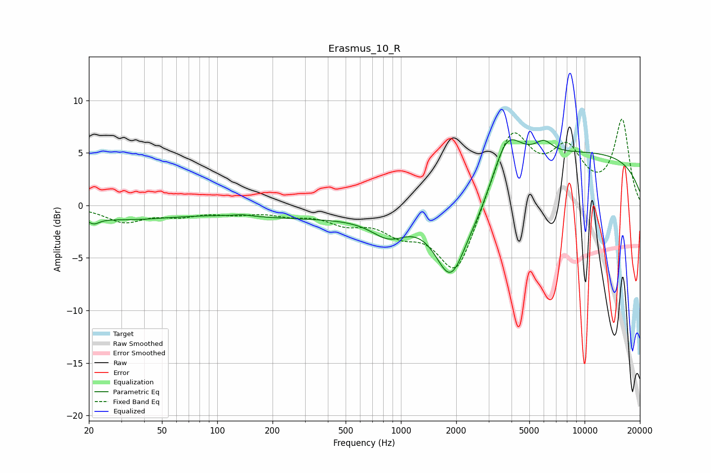

# Erasmus_10_R
See [usage instructions](https://github.com/jaakkopasanen/AutoEq#usage) for more options and info.

### Parametric EQs
Apply preamp of -6.4 dB when using parametric equalizer.

|   # | Type    |   Fc (Hz) |    Q |   Gain (dB) |
|-----|---------|-----------|------|-------------|
|   1 | Peaking |        21 | 4.54 |        -0.6 |
|   2 | Peaking |        30 | 0.47 |        -1.2 |
|   3 | Peaking |       136 | 3.17 |         0.2 |
|   4 | Peaking |       338 | 0.31 |        -1.1 |
|   5 | Peaking |       862 | 1.44 |        -2.1 |
|   6 | Peaking |      1868 | 1.56 |        -7.6 |
|   7 | Peaking |      2665 | 1.53 |        -1.8 |
|   8 | Peaking |      3769 | 1.82 |         4   |
|   9 | Peaking |      5989 | 2.93 |         1.2 |
|  10 | Peaking |      9391 | 0.2  |         5   |

### Fixed Band EQs
When using fixed band (also called graphic) equalizer, apply preamp of **-8.3 dB** (if available) and set gains manually with these parameters.

|   # | Type    |   Fc (Hz) |    Q |   Gain (dB) |
|-----|---------|-----------|------|-------------|
|   1 | Peaking |        31 | 1.41 |        -1.5 |
|   2 | Peaking |        62 | 1.41 |        -0.8 |
|   3 | Peaking |       125 | 1.41 |        -0.6 |
|   4 | Peaking |       250 | 1.41 |        -0.7 |
|   5 | Peaking |       500 | 1.41 |        -1.4 |
|   6 | Peaking |      1000 | 1.41 |        -2.1 |
|   7 | Peaking |      2000 | 1.41 |        -6.9 |
|   8 | Peaking |      4000 | 1.41 |         7.4 |
|   9 | Peaking |      8000 | 1.41 |         4.6 |
|  10 | Peaking |     16000 | 1.41 |         8   |

### Graphs

