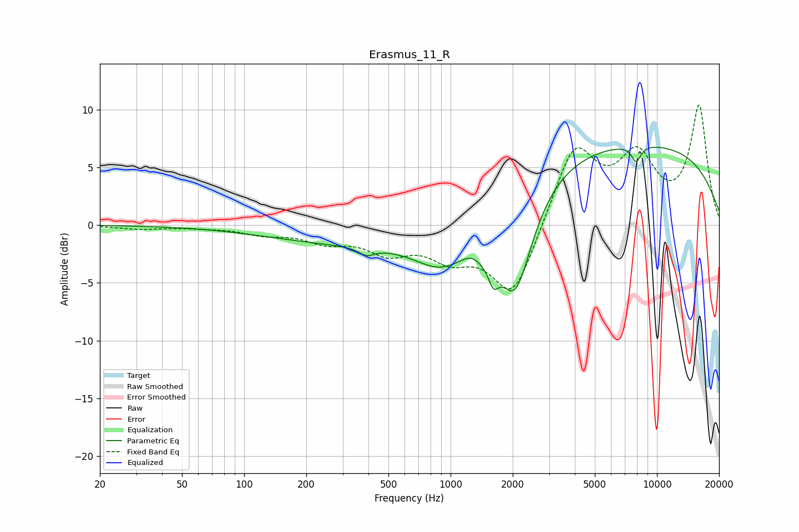

# Erasmus_11_R
See [usage instructions](https://github.com/jaakkopasanen/AutoEq#usage) for more options and info.

### Parametric EQs
Apply preamp of -6.8 dB when using parametric equalizer.

|   # | Type    |   Fc (Hz) |    Q |   Gain (dB) |
|-----|---------|-----------|------|-------------|
|   1 | Peaking |       358 | 0.33 |        -1.6 |
|   2 | Peaking |       392 | 3.8  |        -0.7 |
|   3 | Peaking |       918 | 0.98 |        -3.6 |
|   4 | Peaking |      1285 | 2.75 |         1.1 |
|   5 | Peaking |      1349 | 2.81 |        -0.2 |
|   6 | Peaking |      1380 | 1.89 |        -1.5 |
|   7 | Peaking |      1615 | 5.87 |        -1.8 |
|   8 | Peaking |      2062 | 1.64 |        -9   |
|   9 | Peaking |      6922 | 0.18 |         7.2 |
|  10 | Peaking |      7931 | 5.93 |        -1.4 |

### Fixed Band EQs
When using fixed band (also called graphic) equalizer, apply preamp of **-10.5 dB** (if available) and set gains manually with these parameters.

|   # | Type    |   Fc (Hz) |    Q |   Gain (dB) |
|-----|---------|-----------|------|-------------|
|   1 | Peaking |        31 | 1.41 |        -0.3 |
|   2 | Peaking |        62 | 1.41 |        -0.1 |
|   3 | Peaking |       125 | 1.41 |        -0.7 |
|   4 | Peaking |       250 | 1.41 |        -1.2 |
|   5 | Peaking |       500 | 1.41 |        -2   |
|   6 | Peaking |      1000 | 1.41 |        -2.3 |
|   7 | Peaking |      2000 | 1.41 |        -6.3 |
|   8 | Peaking |      4000 | 1.41 |         6.9 |
|   9 | Peaking |      8000 | 1.41 |         5.3 |
|  10 | Peaking |     16000 | 1.41 |        10.1 |

### Graphs

