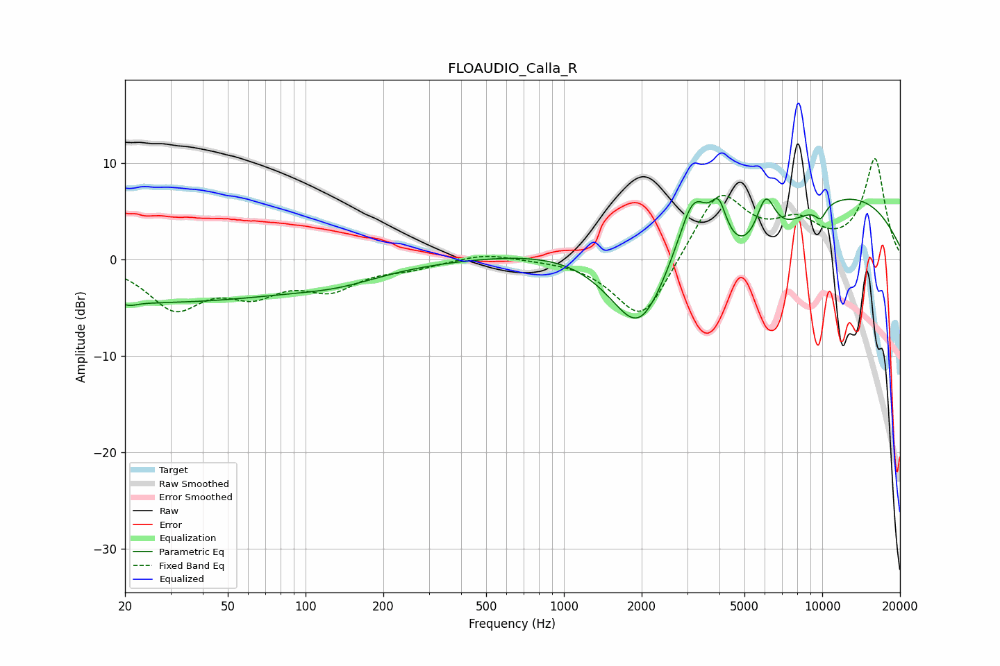

# FLOAUDIO_Calla_R
See [usage instructions](https://github.com/jaakkopasanen/AutoEq#usage) for more options and info.

### Parametric EQs
Apply preamp of -6.4 dB when using parametric equalizer.

|   # | Type    |   Fc (Hz) |    Q |   Gain (dB) |
|-----|---------|-----------|------|-------------|
|   1 | Peaking |        21 | 5.5  |        -0.3 |
|   2 | Peaking |        22 | 0.18 |        -4.5 |
|   3 | Peaking |       136 | 0.87 |        -1   |
|   4 | Peaking |      1954 | 1.01 |       -12.1 |
|   5 | Peaking |      3171 | 2.25 |         6.9 |
|   6 | Peaking |      3974 | 4.63 |         3.8 |
|   7 | Peaking |      5326 | 0.73 |        -8.2 |
|   8 | Peaking |      6036 | 3.48 |         5.3 |
|   9 | Peaking |      6361 | 0.18 |         9.4 |
|  10 | Peaking |      9862 | 5.66 |        -1.4 |

### Fixed Band EQs
When using fixed band (also called graphic) equalizer, apply preamp of **-10.5 dB** (if available) and set gains manually with these parameters.

|   # | Type    |   Fc (Hz) |    Q |   Gain (dB) |
|-----|---------|-----------|------|-------------|
|   1 | Peaking |        31 | 1.41 |        -4.8 |
|   2 | Peaking |        62 | 1.41 |        -2.9 |
|   3 | Peaking |       125 | 1.41 |        -2.7 |
|   4 | Peaking |       250 | 1.41 |        -0.7 |
|   5 | Peaking |       500 | 1.41 |         0.7 |
|   6 | Peaking |      1000 | 1.41 |         0.1 |
|   7 | Peaking |      2000 | 1.41 |        -6.8 |
|   8 | Peaking |      4000 | 1.41 |         7.2 |
|   9 | Peaking |      8000 | 1.41 |         3.1 |
|  10 | Peaking |     16000 | 1.41 |        10.3 |

### Graphs

