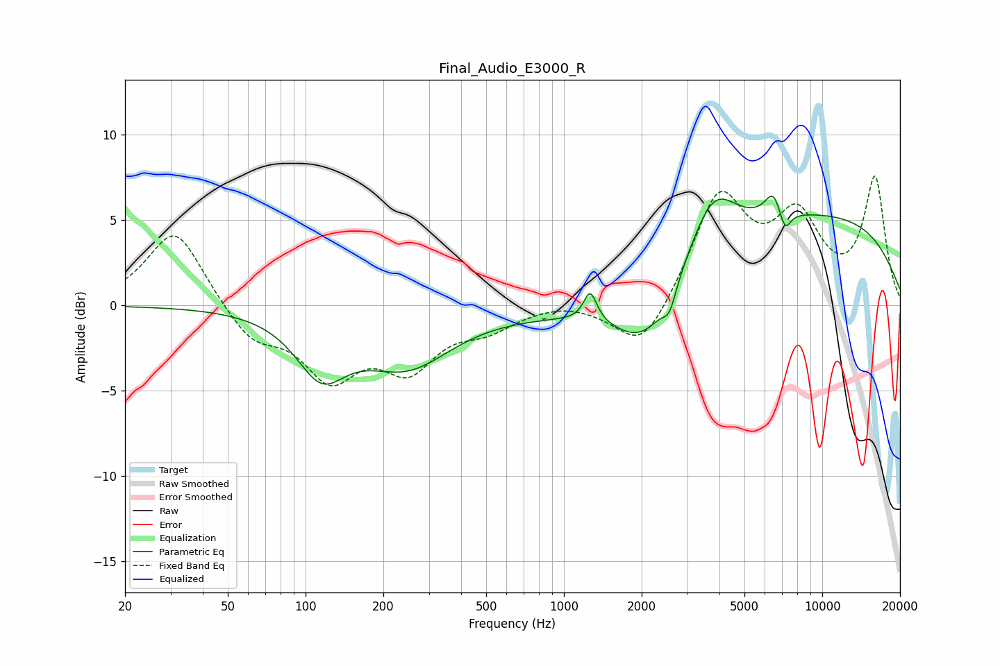

# Final_Audio_E3000_R
See [usage instructions](https://github.com/jaakkopasanen/AutoEq#usage) for more options and info.

### Parametric EQs
Apply preamp of -6.5 dB when using parametric equalizer.

|   # | Type    |   Fc (Hz) |    Q |   Gain (dB) |
|-----|---------|-----------|------|-------------|
|   1 | Peaking |       115 | 1.47 |        -3.4 |
|   2 | Peaking |       246 | 0.81 |        -3.3 |
|   3 | Peaking |      1265 | 5.68 |         1.7 |
|   4 | Peaking |      2072 | 1.15 |        -3.6 |
|   5 | Peaking |      2121 | 0.37 |        -1.8 |
|   6 | Peaking |      2565 | 5.78 |        -1.2 |
|   7 | Peaking |      3774 | 1.55 |         3.7 |
|   8 | Peaking |      6480 | 4.1  |         1.5 |
|   9 | Peaking |      7162 | 5.89 |        -1.3 |
|  10 | Peaking |      7725 | 0.21 |         5.6 |

### Fixed Band EQs
When using fixed band (also called graphic) equalizer, apply preamp of **-7.7 dB** (if available) and set gains manually with these parameters.

|   # | Type    |   Fc (Hz) |    Q |   Gain (dB) |
|-----|---------|-----------|------|-------------|
|   1 | Peaking |        31 | 1.41 |         4.6 |
|   2 | Peaking |        62 | 1.41 |        -2   |
|   3 | Peaking |       125 | 1.41 |        -3.9 |
|   4 | Peaking |       250 | 1.41 |        -3.3 |
|   5 | Peaking |       500 | 1.41 |        -1.1 |
|   6 | Peaking |      1000 | 1.41 |         0.3 |
|   7 | Peaking |      2000 | 1.41 |        -2.9 |
|   8 | Peaking |      4000 | 1.41 |         6.4 |
|   9 | Peaking |      8000 | 1.41 |         4.6 |
|  10 | Peaking |     16000 | 1.41 |         7.3 |

### Graphs

