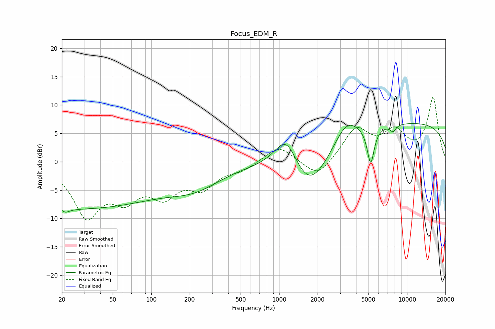

# Focus_EDM_R
See [usage instructions](https://github.com/jaakkopasanen/AutoEq#usage) for more options and info.

### Parametric EQs
Apply preamp of -6.8 dB when using parametric equalizer.

|   # | Type    |   Fc (Hz) |    Q |   Gain (dB) |
|-----|---------|-----------|------|-------------|
|   1 | Peaking |        20 | 5.73 |         2.9 |
|   2 | Peaking |        20 | 4.62 |        -3.3 |
|   3 | Peaking |        26 | 0.18 |        -8.2 |
|   4 | Peaking |       223 | 0.69 |        -3   |
|   5 | Peaking |      1142 | 1.46 |         7   |
|   6 | Peaking |      1698 | 0.87 |        -8.4 |
|   7 | Peaking |      3348 | 1.46 |         4.2 |
|   8 | Peaking |      5200 | 5.09 |        -6.6 |
|   9 | Peaking |      7781 | 6    |        -1.2 |
|  10 | Peaking |     10000 | 0.18 |         6.9 |

### Fixed Band EQs
When using fixed band (also called graphic) equalizer, apply preamp of **-11.4 dB** (if available) and set gains manually with these parameters.

|   # | Type    |   Fc (Hz) |    Q |   Gain (dB) |
|-----|---------|-----------|------|-------------|
|   1 | Peaking |        31 | 1.41 |        -9.1 |
|   2 | Peaking |        62 | 1.41 |        -5.2 |
|   3 | Peaking |       125 | 1.41 |        -5   |
|   4 | Peaking |       250 | 1.41 |        -4   |
|   5 | Peaking |       500 | 1.41 |        -1.3 |
|   6 | Peaking |      1000 | 1.41 |         2.9 |
|   7 | Peaking |      2000 | 1.41 |        -3.1 |
|   8 | Peaking |      4000 | 1.41 |         5.6 |
|   9 | Peaking |      8000 | 1.41 |         4.7 |
|  10 | Peaking |     16000 | 1.41 |        11.2 |

### Graphs

