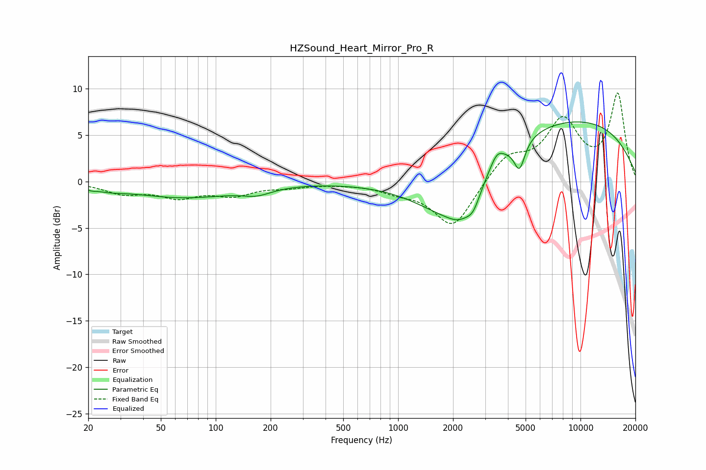

# HZSound_Heart_Mirror_Pro_R
See [usage instructions](https://github.com/jaakkopasanen/AutoEq#usage) for more options and info.

### Parametric EQs
Apply preamp of -6.5 dB when using parametric equalizer.

|   # | Type    |   Fc (Hz) |    Q |   Gain (dB) |
|-----|---------|-----------|------|-------------|
|   1 | Peaking |        21 | 5.92 |        -0.2 |
|   2 | Peaking |        26 | 1.7  |        -0.4 |
|   3 | Peaking |        66 | 0.48 |        -1.7 |
|   4 | Peaking |       168 | 1.8  |        -0.7 |
|   5 | Peaking |      1959 | 0.69 |        -6.1 |
|   6 | Peaking |      2202 | 1.99 |        -1.8 |
|   7 | Peaking |      2586 | 3.74 |        -1.6 |
|   8 | Peaking |      3485 | 3.82 |         1.4 |
|   9 | Peaking |      4629 | 4.78 |        -3   |
|  10 | Peaking |      7657 | 0.22 |         7   |

### Fixed Band EQs
When using fixed band (also called graphic) equalizer, apply preamp of **-9.6 dB** (if available) and set gains manually with these parameters.

|   # | Type    |   Fc (Hz) |    Q |   Gain (dB) |
|-----|---------|-----------|------|-------------|
|   1 | Peaking |        31 | 1.41 |        -1.2 |
|   2 | Peaking |        62 | 1.41 |        -1.5 |
|   3 | Peaking |       125 | 1.41 |        -1.3 |
|   4 | Peaking |       250 | 1.41 |        -0.5 |
|   5 | Peaking |       500 | 1.41 |        -0.1 |
|   6 | Peaking |      1000 | 1.41 |        -0.8 |
|   7 | Peaking |      2000 | 1.41 |        -5   |
|   8 | Peaking |      4000 | 1.41 |         2.7 |
|   9 | Peaking |      8000 | 1.41 |         6.2 |
|  10 | Peaking |     16000 | 1.41 |         9.2 |

### Graphs

