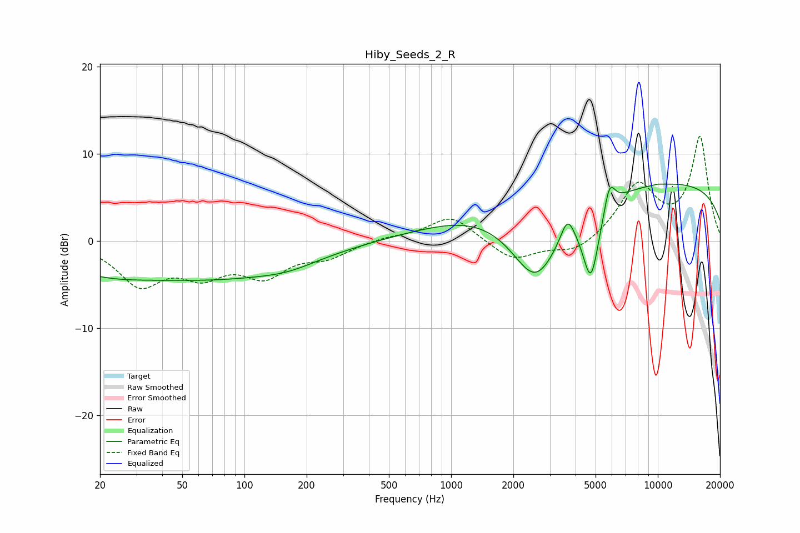

# Hiby_Seeds_2_R
See [usage instructions](https://github.com/jaakkopasanen/AutoEq#usage) for more options and info.

### Parametric EQs
Apply preamp of -6.6 dB when using parametric equalizer.

|   # | Type    |   Fc (Hz) |    Q |   Gain (dB) |
|-----|---------|-----------|------|-------------|
|   1 | Peaking |        20 | 0.58 |        -2.7 |
|   2 | Peaking |        78 | 0.37 |        -3.8 |
|   3 | Peaking |       163 | 1.02 |        -0.8 |
|   4 | Peaking |      1619 | 0.44 |         2.9 |
|   5 | Peaking |      2568 | 1.07 |        -9.9 |
|   6 | Peaking |      3658 | 4.28 |         2.8 |
|   7 | Peaking |      4749 | 3.38 |        -8.4 |
|   8 | Peaking |      5840 | 5.2  |         3.2 |
|   9 | Peaking |     10000 | 6    |         0.1 |
|  10 | Peaking |     10000 | 0.18 |         6.8 |

### Fixed Band EQs
When using fixed band (also called graphic) equalizer, apply preamp of **-12.1 dB** (if available) and set gains manually with these parameters.

|   # | Type    |   Fc (Hz) |    Q |   Gain (dB) |
|-----|---------|-----------|------|-------------|
|   1 | Peaking |        31 | 1.41 |        -4.7 |
|   2 | Peaking |        62 | 1.41 |        -3.3 |
|   3 | Peaking |       125 | 1.41 |        -3.6 |
|   4 | Peaking |       250 | 1.41 |        -1.6 |
|   5 | Peaking |       500 | 1.41 |         0.4 |
|   6 | Peaking |      1000 | 1.41 |         2.9 |
|   7 | Peaking |      2000 | 1.41 |        -2.3 |
|   8 | Peaking |      4000 | 1.41 |        -1.5 |
|   9 | Peaking |      8000 | 1.41 |         6.2 |
|  10 | Peaking |     16000 | 1.41 |        11.8 |

### Graphs

