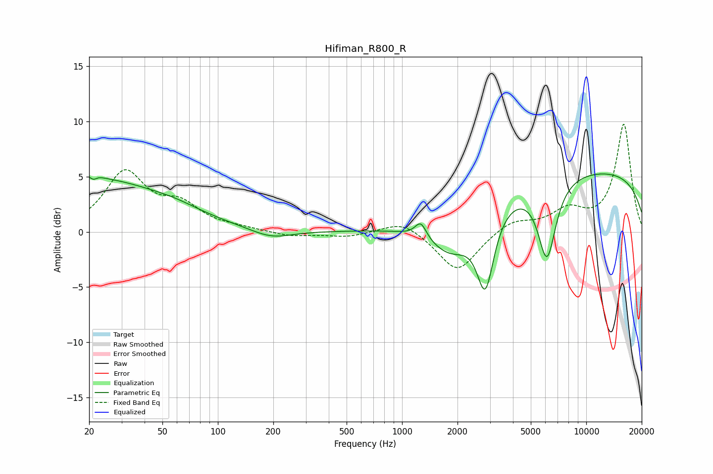

# Hifiman_R800_R
See [usage instructions](https://github.com/jaakkopasanen/AutoEq#usage) for more options and info.

### Parametric EQs
Apply preamp of -5.3 dB when using parametric equalizer.

|   # | Type    |   Fc (Hz) |    Q |   Gain (dB) |
|-----|---------|-----------|------|-------------|
|   1 | Peaking |        20 | 0.34 |         4.8 |
|   2 | Peaking |        21 | 5.18 |         2.8 |
|   3 | Peaking |        21 | 5.91 |        -2.8 |
|   4 | Peaking |        59 | 1.09 |         0.4 |
|   5 | Peaking |       195 | 1.28 |        -0.8 |
|   6 | Peaking |      1264 | 4.59 |         1.5 |
|   7 | Peaking |      1860 | 1.11 |        -3.7 |
|   8 | Peaking |      2834 | 3.04 |        -6.8 |
|   9 | Peaking |      6117 | 2.79 |        -7.1 |
|  10 | Peaking |      9521 | 0.18 |         5.6 |

### Fixed Band EQs
When using fixed band (also called graphic) equalizer, apply preamp of **-9.8 dB** (if available) and set gains manually with these parameters.

|   # | Type    |   Fc (Hz) |    Q |   Gain (dB) |
|-----|---------|-----------|------|-------------|
|   1 | Peaking |        31 | 1.41 |         5.2 |
|   2 | Peaking |        62 | 1.41 |         2.1 |
|   3 | Peaking |       125 | 1.41 |         0.3 |
|   4 | Peaking |       250 | 1.41 |        -0.4 |
|   5 | Peaking |       500 | 1.41 |        -0.4 |
|   6 | Peaking |      1000 | 1.41 |         1.1 |
|   7 | Peaking |      2000 | 1.41 |        -3.7 |
|   8 | Peaking |      4000 | 1.41 |         1.1 |
|   9 | Peaking |      8000 | 1.41 |         1.8 |
|  10 | Peaking |     16000 | 1.41 |         9.7 |

### Graphs

