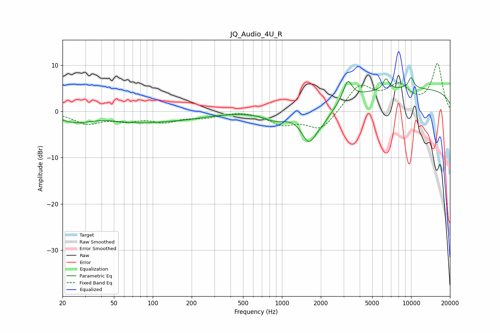

# JQ_Audio_4U_R
See [usage instructions](https://github.com/jaakkopasanen/AutoEq#usage) for more options and info.

### Parametric EQs
Apply preamp of -7.4 dB when using parametric equalizer.

|   # | Type    |   Fc (Hz) |    Q |   Gain (dB) |
|-----|---------|-----------|------|-------------|
|   1 | Peaking |        25 | 1.12 |        -1.9 |
|   2 | Peaking |        75 | 0.66 |        -1.9 |
|   3 | Peaking |       176 | 0.71 |        -1.1 |
|   4 | Peaking |       894 | 1.57 |        -1.9 |
|   5 | Peaking |      1611 | 2.35 |        -6.4 |
|   6 | Peaking |      2069 | 1.71 |        -2.8 |
|   7 | Peaking |      3230 | 4.24 |         4.2 |
|   8 | Peaking |      6387 | 6    |         2.4 |
|   9 | Peaking |     10000 | 0.18 |         4.9 |
|  10 | Peaking |     10000 | 5.84 |         2.4 |

### Fixed Band EQs
When using fixed band (also called graphic) equalizer, apply preamp of **-10.4 dB** (if available) and set gains manually with these parameters.

|   # | Type    |   Fc (Hz) |    Q |   Gain (dB) |
|-----|---------|-----------|------|-------------|
|   1 | Peaking |        31 | 1.41 |        -2.5 |
|   2 | Peaking |        62 | 1.41 |        -1.6 |
|   3 | Peaking |       125 | 1.41 |        -1.9 |
|   4 | Peaking |       250 | 1.41 |        -1.1 |
|   5 | Peaking |       500 | 1.41 |         0.3 |
|   6 | Peaking |      1000 | 1.41 |        -2.5 |
|   7 | Peaking |      2000 | 1.41 |        -4.1 |
|   8 | Peaking |      4000 | 1.41 |         5.5 |
|   9 | Peaking |      8000 | 1.41 |         4.9 |
|  10 | Peaking |     16000 | 1.41 |        10.1 |

### Graphs

