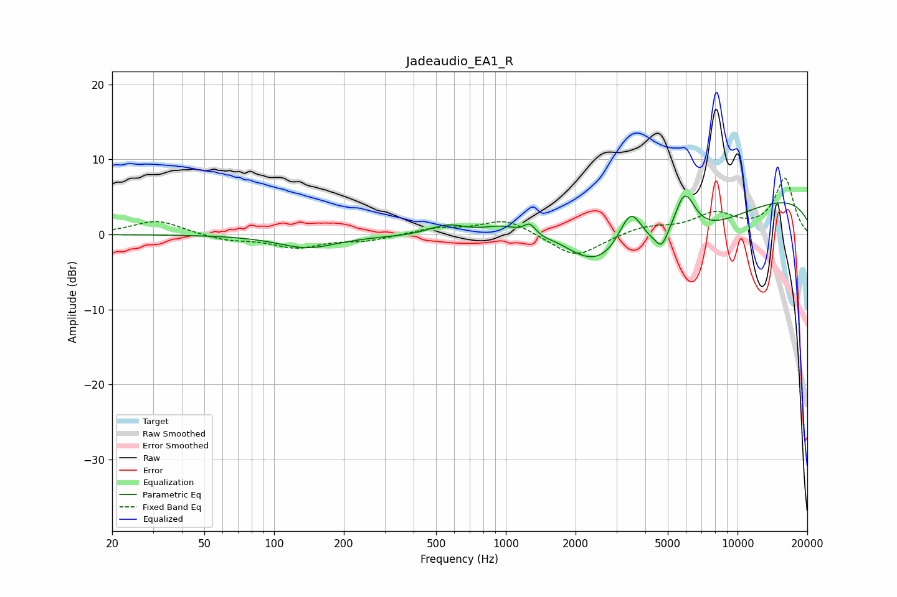

# Jadeaudio_EA1_R
See [usage instructions](https://github.com/jaakkopasanen/AutoEq#usage) for more options and info.

### Parametric EQs
Apply preamp of -5.2 dB when using parametric equalizer.

|   # | Type    |   Fc (Hz) |    Q |   Gain (dB) |
|-----|---------|-----------|------|-------------|
|   1 | Peaking |       139 | 1.12 |        -1.7 |
|   2 | Peaking |       562 | 1.66 |         1.7 |
|   3 | Peaking |       988 | 1.31 |         2.8 |
|   4 | Peaking |      1270 | 5.39 |         1.6 |
|   5 | Peaking |      1661 | 1.4  |         2.4 |
|   6 | Peaking |      3302 | 0.43 |       -11   |
|   7 | Peaking |      3462 | 2.22 |         8.1 |
|   8 | Peaking |      4709 | 5.99 |        -1.7 |
|   9 | Peaking |      5903 | 2.81 |         6.7 |
|  10 | Peaking |     10000 | 0.18 |         5.8 |

### Fixed Band EQs
When using fixed band (also called graphic) equalizer, apply preamp of **-7.6 dB** (if available) and set gains manually with these parameters.

|   # | Type    |   Fc (Hz) |    Q |   Gain (dB) |
|-----|---------|-----------|------|-------------|
|   1 | Peaking |        31 | 1.41 |         1.9 |
|   2 | Peaking |        62 | 1.41 |        -0.8 |
|   3 | Peaking |       125 | 1.41 |        -1.7 |
|   4 | Peaking |       250 | 1.41 |        -0.8 |
|   5 | Peaking |       500 | 1.41 |         0.8 |
|   6 | Peaking |      1000 | 1.41 |         2.1 |
|   7 | Peaking |      2000 | 1.41 |        -3.2 |
|   8 | Peaking |      4000 | 1.41 |         1   |
|   9 | Peaking |      8000 | 1.41 |         2.6 |
|  10 | Peaking |     16000 | 1.41 |         7.4 |

### Graphs

