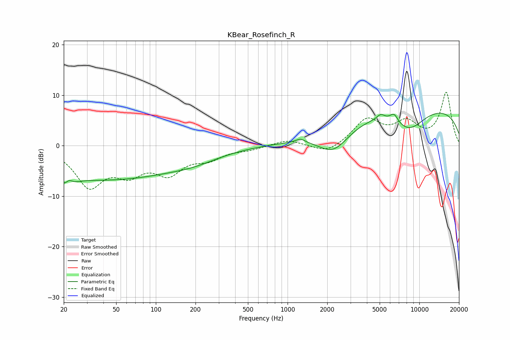

# KBear_Rosefinch_R
See [usage instructions](https://github.com/jaakkopasanen/AutoEq#usage) for more options and info.

### Parametric EQs
Apply preamp of -6.5 dB when using parametric equalizer.

|   # | Type    |   Fc (Hz) |    Q |   Gain (dB) |
|-----|---------|-----------|------|-------------|
|   1 | Peaking |        21 | 3.25 |        -5.1 |
|   2 | Peaking |        22 | 4.3  |         4.1 |
|   3 | Peaking |        40 | 0.23 |        -6.6 |
|   4 | Peaking |       200 | 0.76 |        -1.2 |
|   5 | Peaking |      1252 | 4.17 |         0.8 |
|   6 | Peaking |      2228 | 1.15 |        -5.1 |
|   7 | Peaking |      5095 | 4.62 |         1.1 |
|   8 | Peaking |      6421 | 4.38 |         1.8 |
|   9 | Peaking |      8342 | 1.04 |        -4.4 |
|  10 | Peaking |      9206 | 0.18 |         8   |

### Fixed Band EQs
When using fixed band (also called graphic) equalizer, apply preamp of **-10.7 dB** (if available) and set gains manually with these parameters.

|   # | Type    |   Fc (Hz) |    Q |   Gain (dB) |
|-----|---------|-----------|------|-------------|
|   1 | Peaking |        31 | 1.41 |        -7.6 |
|   2 | Peaking |        62 | 1.41 |        -4.4 |
|   3 | Peaking |       125 | 1.41 |        -4.8 |
|   4 | Peaking |       250 | 1.41 |        -2.2 |
|   5 | Peaking |       500 | 1.41 |        -0.6 |
|   6 | Peaking |      1000 | 1.41 |         1.2 |
|   7 | Peaking |      2000 | 1.41 |        -1.8 |
|   8 | Peaking |      4000 | 1.41 |         5   |
|   9 | Peaking |      8000 | 1.41 |         4.1 |
|  10 | Peaking |     16000 | 1.41 |        10.4 |

### Graphs

