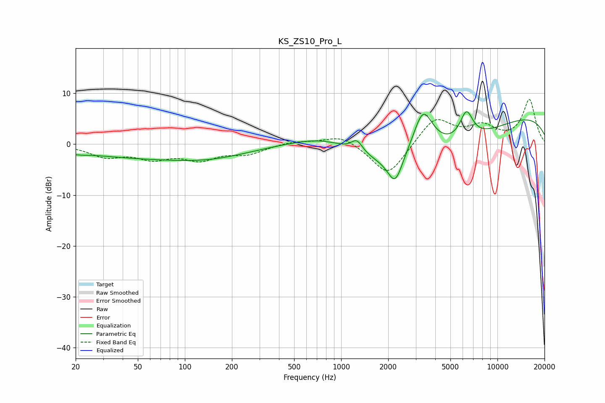

# KS_ZS10_Pro_L
See [usage instructions](https://github.com/jaakkopasanen/AutoEq#usage) for more options and info.

### Parametric EQs
Apply preamp of -6.5 dB when using parametric equalizer.

|   # | Type    |   Fc (Hz) |    Q |   Gain (dB) |
|-----|---------|-----------|------|-------------|
|   1 | Peaking |        20 | 1.89 |        -0.6 |
|   2 | Peaking |        44 | 0.42 |        -2.1 |
|   3 | Peaking |       144 | 0.53 |        -2.3 |
|   4 | Peaking |       815 | 0.6  |         4.6 |
|   5 | Peaking |      1262 | 3.81 |         2.4 |
|   6 | Peaking |      2216 | 2.95 |        -5.7 |
|   7 | Peaking |      2797 | 0.28 |        -9.6 |
|   8 | Peaking |      3338 | 2.02 |         9.6 |
|   9 | Peaking |      6334 | 3.28 |         5.5 |
|  10 | Peaking |      9027 | 0.18 |         7   |

### Fixed Band EQs
When using fixed band (also called graphic) equalizer, apply preamp of **-8.9 dB** (if available) and set gains manually with these parameters.

|   # | Type    |   Fc (Hz) |    Q |   Gain (dB) |
|-----|---------|-----------|------|-------------|
|   1 | Peaking |        31 | 1.41 |        -2.3 |
|   2 | Peaking |        62 | 1.41 |        -2.4 |
|   3 | Peaking |       125 | 1.41 |        -2.7 |
|   4 | Peaking |       250 | 1.41 |        -1.7 |
|   5 | Peaking |       500 | 1.41 |         0.6 |
|   6 | Peaking |      1000 | 1.41 |         1.9 |
|   7 | Peaking |      2000 | 1.41 |        -6.6 |
|   8 | Peaking |      4000 | 1.41 |         5.3 |
|   9 | Peaking |      8000 | 1.41 |         3.1 |
|  10 | Peaking |     16000 | 1.41 |         8.6 |

### Graphs

