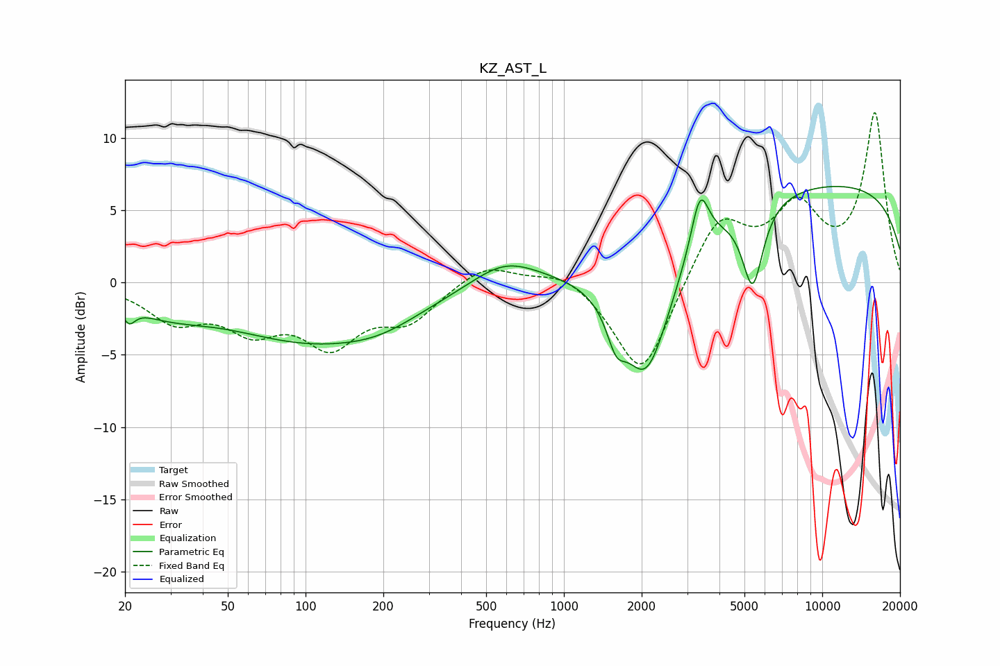

# KZ_AST_L
See [usage instructions](https://github.com/jaakkopasanen/AutoEq#usage) for more options and info.

### Parametric EQs
Apply preamp of -6.7 dB when using parametric equalizer.

|   # | Type    |   Fc (Hz) |    Q |   Gain (dB) |
|-----|---------|-----------|------|-------------|
|   1 | Peaking |        21 | 5.99 |        -1.1 |
|   2 | Peaking |        29 | 0.88 |        -1.4 |
|   3 | Peaking |       108 | 0.42 |        -3.9 |
|   4 | Peaking |       196 | 0.99 |        -0.7 |
|   5 | Peaking |       590 | 1.08 |         1.8 |
|   6 | Peaking |      1592 | 3.95 |        -2.3 |
|   7 | Peaking |      2086 | 1.43 |        -9.2 |
|   8 | Peaking |      3363 | 4.07 |         4   |
|   9 | Peaking |      5380 | 3.44 |        -5.7 |
|  10 | Peaking |      9712 | 0.18 |         6.9 |

### Fixed Band EQs
When using fixed band (also called graphic) equalizer, apply preamp of **-11.8 dB** (if available) and set gains manually with these parameters.

|   # | Type    |   Fc (Hz) |    Q |   Gain (dB) |
|-----|---------|-----------|------|-------------|
|   1 | Peaking |        31 | 1.41 |        -2.4 |
|   2 | Peaking |        62 | 1.41 |        -2.7 |
|   3 | Peaking |       125 | 1.41 |        -3.9 |
|   4 | Peaking |       250 | 1.41 |        -2.4 |
|   5 | Peaking |       500 | 1.41 |         1.4 |
|   6 | Peaking |      1000 | 1.41 |         1   |
|   7 | Peaking |      2000 | 1.41 |        -6.8 |
|   8 | Peaking |      4000 | 1.41 |         4.6 |
|   9 | Peaking |      8000 | 1.41 |         4.7 |
|  10 | Peaking |     16000 | 1.41 |        11.6 |

### Graphs

