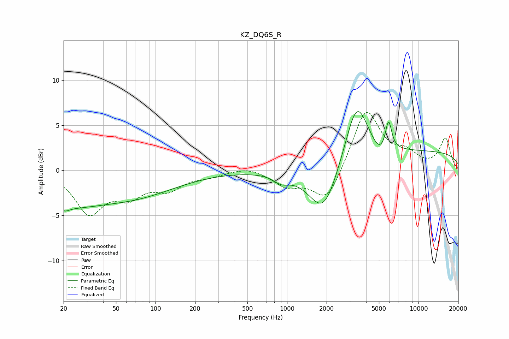

# KZ_DQ6S_R
See [usage instructions](https://github.com/jaakkopasanen/AutoEq#usage) for more options and info.

### Parametric EQs
Apply preamp of -6.6 dB when using parametric equalizer.

|   # | Type    |   Fc (Hz) |    Q |   Gain (dB) |
|-----|---------|-----------|------|-------------|
|   1 | Peaking |        20 | 5.77 |         3.3 |
|   2 | Peaking |        20 | 5.47 |        -3.7 |
|   3 | Peaking |        27 | 0.21 |        -4.4 |
|   4 | Peaking |        43 | 0.73 |         0.4 |
|   5 | Peaking |       904 | 2.34 |        -0.9 |
|   6 | Peaking |      1900 | 1.24 |        -5.7 |
|   7 | Peaking |      3385 | 1.59 |         6.9 |
|   8 | Peaking |      5056 | 2.33 |        -1.4 |
|   9 | Peaking |      5918 | 5.78 |         3.3 |
|  10 | Peaking |     10000 | 0.18 |         2.1 |

### Fixed Band EQs
When using fixed band (also called graphic) equalizer, apply preamp of **-6.5 dB** (if available) and set gains manually with these parameters.

|   # | Type    |   Fc (Hz) |    Q |   Gain (dB) |
|-----|---------|-----------|------|-------------|
|   1 | Peaking |        31 | 1.41 |        -4.5 |
|   2 | Peaking |        62 | 1.41 |        -2.4 |
|   3 | Peaking |       125 | 1.41 |        -1.8 |
|   4 | Peaking |       250 | 1.41 |        -0.5 |
|   5 | Peaking |       500 | 1.41 |         0.5 |
|   6 | Peaking |      1000 | 1.41 |        -1.6 |
|   7 | Peaking |      2000 | 1.41 |        -3.6 |
|   8 | Peaking |      4000 | 1.41 |         6.8 |
|   9 | Peaking |      8000 | 1.41 |         1.5 |
|  10 | Peaking |     16000 | 1.41 |         3.5 |

### Graphs

