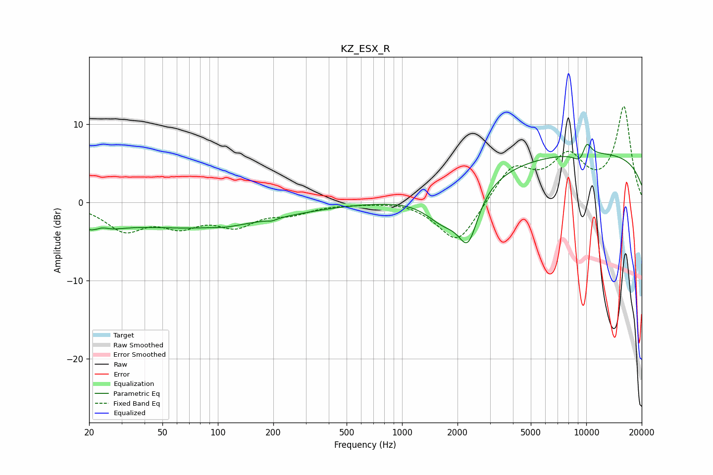

# KZ_ESX_R
See [usage instructions](https://github.com/jaakkopasanen/AutoEq#usage) for more options and info.

### Parametric EQs
Apply preamp of -7.5 dB when using parametric equalizer.

|   # | Type    |   Fc (Hz) |    Q |   Gain (dB) |
|-----|---------|-----------|------|-------------|
|   1 | Peaking |        21 | 1.29 |        -2.4 |
|   2 | Peaking |        23 | 3.83 |         0.7 |
|   3 | Peaking |        76 | 0.31 |        -3.1 |
|   4 | Peaking |       111 | 2.65 |        -0.2 |
|   5 | Peaking |       197 | 6    |        -0.3 |
|   6 | Peaking |      1688 | 1.4  |        -3.7 |
|   7 | Peaking |      2284 | 2.59 |        -6.3 |
|   8 | Peaking |      9452 | 3.37 |        -1.9 |
|   9 | Peaking |     10000 | 4.48 |         2.6 |
|  10 | Peaking |     10000 | 0.18 |         6.4 |

### Fixed Band EQs
When using fixed band (also called graphic) equalizer, apply preamp of **-12.4 dB** (if available) and set gains manually with these parameters.

|   # | Type    |   Fc (Hz) |    Q |   Gain (dB) |
|-----|---------|-----------|------|-------------|
|   1 | Peaking |        31 | 1.41 |        -3.3 |
|   2 | Peaking |        62 | 1.41 |        -2.5 |
|   3 | Peaking |       125 | 1.41 |        -2.6 |
|   4 | Peaking |       250 | 1.41 |        -1.2 |
|   5 | Peaking |       500 | 1.41 |        -0.1 |
|   6 | Peaking |      1000 | 1.41 |         0.3 |
|   7 | Peaking |      2000 | 1.41 |        -5.5 |
|   8 | Peaking |      4000 | 1.41 |         4.6 |
|   9 | Peaking |      8000 | 1.41 |         5.3 |
|  10 | Peaking |     16000 | 1.41 |        12.1 |

### Graphs

