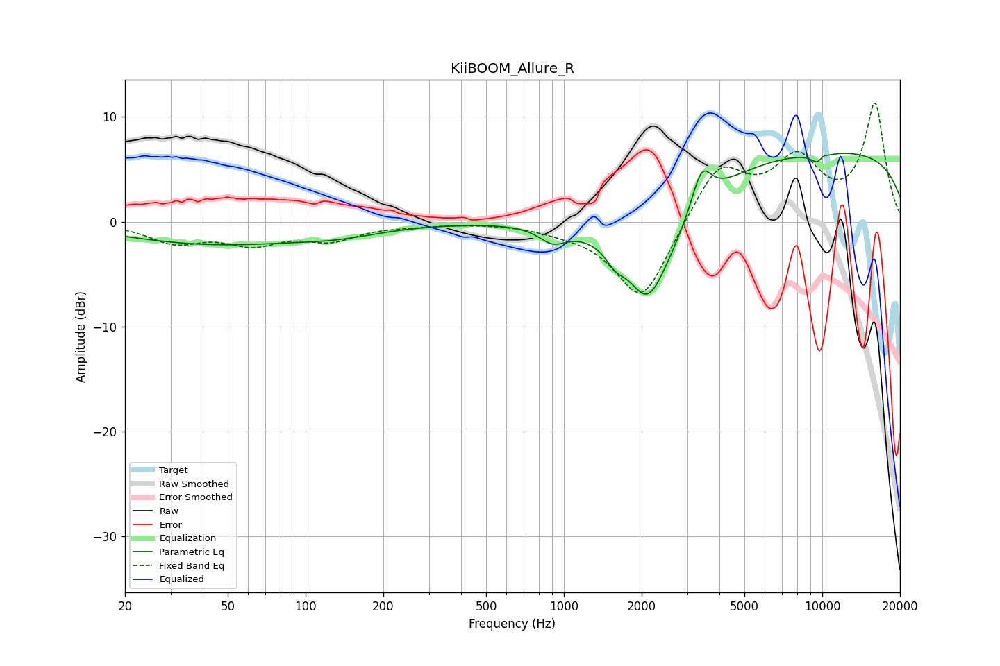

# KiiBOOM_Allure_R
See [usage instructions](https://github.com/jaakkopasanen/AutoEq#usage) for more options and info.

### Parametric EQs
Apply preamp of -6.6 dB when using parametric equalizer.

|   # | Type    |   Fc (Hz) |    Q |   Gain (dB) |
|-----|---------|-----------|------|-------------|
|   1 | Peaking |        44 | 0.4  |        -2.1 |
|   2 | Peaking |       135 | 0.83 |        -0.8 |
|   3 | Peaking |       905 | 2.66 |        -1.5 |
|   4 | Peaking |      1582 | 4.11 |        -1.2 |
|   5 | Peaking |      2098 | 2.7  |        -2.1 |
|   6 | Peaking |      2175 | 1.1  |        -8.2 |
|   7 | Peaking |      3413 | 3.7  |         3.8 |
|   8 | Peaking |      9769 | 4.38 |        -1.5 |
|   9 | Peaking |     10000 | 0.18 |         6.8 |
|  10 | Peaking |     10000 | 5.98 |         1   |

### Fixed Band EQs
When using fixed band (also called graphic) equalizer, apply preamp of **-11.4 dB** (if available) and set gains manually with these parameters.

|   # | Type    |   Fc (Hz) |    Q |   Gain (dB) |
|-----|---------|-----------|------|-------------|
|   1 | Peaking |        31 | 1.41 |        -1.8 |
|   2 | Peaking |        62 | 1.41 |        -1.9 |
|   3 | Peaking |       125 | 1.41 |        -1.6 |
|   4 | Peaking |       250 | 1.41 |        -0.2 |
|   5 | Peaking |       500 | 1.41 |        -0   |
|   6 | Peaking |      1000 | 1.41 |        -0.5 |
|   7 | Peaking |      2000 | 1.41 |        -7.8 |
|   8 | Peaking |      4000 | 1.41 |         5.5 |
|   9 | Peaking |      8000 | 1.41 |         5.4 |
|  10 | Peaking |     16000 | 1.41 |        11.1 |

### Graphs

