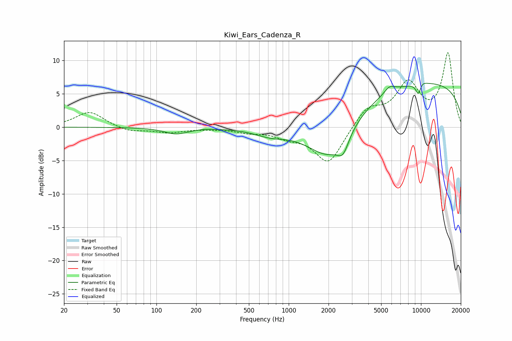

# Kiwi_Ears_Cadenza_R
See [usage instructions](https://github.com/jaakkopasanen/AutoEq#usage) for more options and info.

### Parametric EQs
Apply preamp of -6.7 dB when using parametric equalizer.

|   # | Type    |   Fc (Hz) |    Q |   Gain (dB) |
|-----|---------|-----------|------|-------------|
|   1 | Peaking |       141 | 1.61 |        -1   |
|   2 | Peaking |       234 | 4.52 |         0.1 |
|   3 | Peaking |       727 | 1.16 |        -1   |
|   4 | Peaking |      2022 | 0.85 |        -6.2 |
|   5 | Peaking |      2577 | 3.25 |        -2.5 |
|   6 | Peaking |      5794 | 3.39 |         1   |
|   7 | Peaking |      9574 | 6    |        -2   |
|   8 | Peaking |      9955 | 5.91 |         0.1 |
|   9 | Peaking |     10000 | 0.2  |         6.8 |
|  10 | Peaking |     10000 | 3.63 |         0.6 |

### Fixed Band EQs
When using fixed band (also called graphic) equalizer, apply preamp of **-11.3 dB** (if available) and set gains manually with these parameters.

|   # | Type    |   Fc (Hz) |    Q |   Gain (dB) |
|-----|---------|-----------|------|-------------|
|   1 | Peaking |        31 | 1.41 |         2.3 |
|   2 | Peaking |        62 | 1.41 |        -0.7 |
|   3 | Peaking |       125 | 1.41 |        -0.8 |
|   4 | Peaking |       250 | 1.41 |        -0.1 |
|   5 | Peaking |       500 | 1.41 |        -0.6 |
|   6 | Peaking |      1000 | 1.41 |        -1.1 |
|   7 | Peaking |      2000 | 1.41 |        -5.5 |
|   8 | Peaking |      4000 | 1.41 |         2.9 |
|   9 | Peaking |      8000 | 1.41 |         6.2 |
|  10 | Peaking |     16000 | 1.41 |        10.9 |

### Graphs

