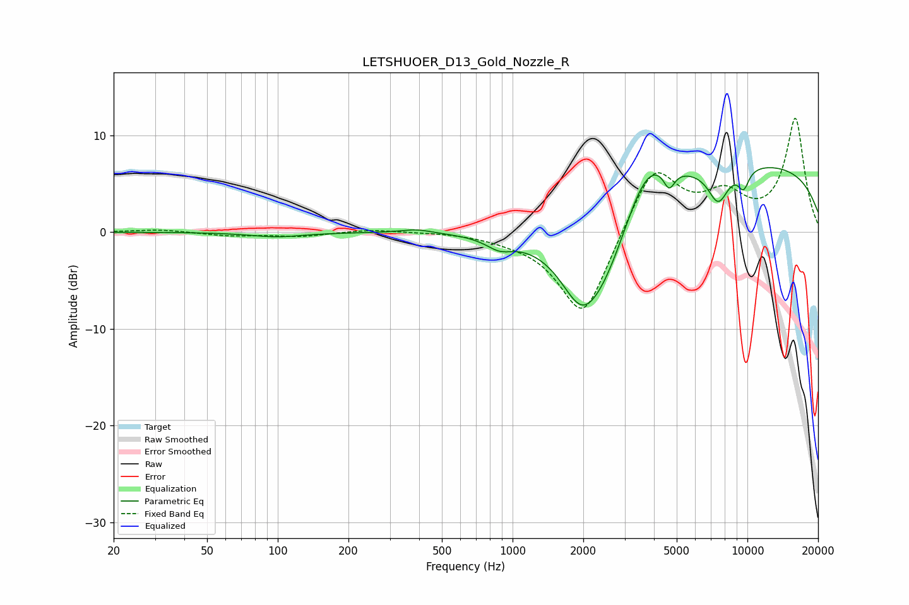

# LETSHUOER_D13_Gold_Nozzle_R
See [usage instructions](https://github.com/jaakkopasanen/AutoEq#usage) for more options and info.

### Parametric EQs
Apply preamp of -6.8 dB when using parametric equalizer.

|   # | Type    |   Fc (Hz) |    Q |   Gain (dB) |
|-----|---------|-----------|------|-------------|
|   1 | Peaking |        99 | 1.24 |        -0.5 |
|   2 | Peaking |       389 | 2.09 |         0.4 |
|   3 | Peaking |       879 | 2.45 |        -1.1 |
|   4 | Peaking |      1961 | 1.73 |        -4.6 |
|   5 | Peaking |      2449 | 0.87 |        -9.5 |
|   6 | Peaking |      3699 | 1.26 |         6.4 |
|   7 | Peaking |      4640 | 5.82 |        -2   |
|   8 | Peaking |      7513 | 3.04 |        -3.6 |
|   9 | Peaking |      9201 | 0.19 |         7.3 |
|  10 | Peaking |      9632 | 5.3  |        -2   |

### Fixed Band EQs
When using fixed band (also called graphic) equalizer, apply preamp of **-11.9 dB** (if available) and set gains manually with these parameters.

|   # | Type    |   Fc (Hz) |    Q |   Gain (dB) |
|-----|---------|-----------|------|-------------|
|   1 | Peaking |        31 | 1.41 |         0.3 |
|   2 | Peaking |        62 | 1.41 |        -0.4 |
|   3 | Peaking |       125 | 1.41 |        -0.4 |
|   4 | Peaking |       250 | 1.41 |         0.3 |
|   5 | Peaking |       500 | 1.41 |         0.1 |
|   6 | Peaking |      1000 | 1.41 |        -0.4 |
|   7 | Peaking |      2000 | 1.41 |        -9.2 |
|   8 | Peaking |      4000 | 1.41 |         7.1 |
|   9 | Peaking |      8000 | 1.41 |         3.3 |
|  10 | Peaking |     16000 | 1.41 |        11.6 |

### Graphs

