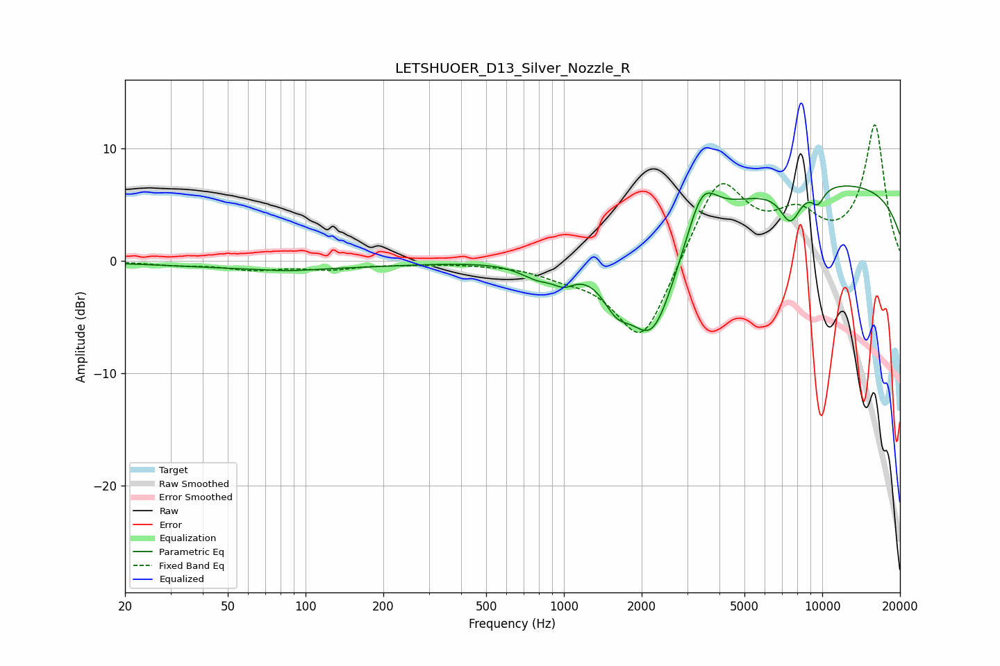

# LETSHUOER_D13_Silver_Nozzle_R
See [usage instructions](https://github.com/jaakkopasanen/AutoEq#usage) for more options and info.

### Parametric EQs
Apply preamp of -6.8 dB when using parametric equalizer.

|   # | Type    |   Fc (Hz) |    Q |   Gain (dB) |
|-----|---------|-----------|------|-------------|
|   1 | Peaking |        81 | 0.34 |        -0.7 |
|   2 | Peaking |        85 | 1.58 |        -0.2 |
|   3 | Peaking |       795 | 1.97 |        -1.3 |
|   4 | Peaking |      1003 | 3.37 |        -1.1 |
|   5 | Peaking |      1595 | 2.66 |        -2.5 |
|   6 | Peaking |      2205 | 1.38 |        -9.7 |
|   7 | Peaking |      3426 | 2.42 |         4.3 |
|   8 | Peaking |      7530 | 3.31 |        -3   |
|   9 | Peaking |      9614 | 4.94 |        -1.4 |
|  10 | Peaking |      9736 | 0.18 |         7.1 |

### Fixed Band EQs
When using fixed band (also called graphic) equalizer, apply preamp of **-12.2 dB** (if available) and set gains manually with these parameters.

|   # | Type    |   Fc (Hz) |    Q |   Gain (dB) |
|-----|---------|-----------|------|-------------|
|   1 | Peaking |        31 | 1.41 |        -0.3 |
|   2 | Peaking |        62 | 1.41 |        -0.7 |
|   3 | Peaking |       125 | 1.41 |        -0.6 |
|   4 | Peaking |       250 | 1.41 |        -0.2 |
|   5 | Peaking |       500 | 1.41 |        -0.1 |
|   6 | Peaking |      1000 | 1.41 |        -0.9 |
|   7 | Peaking |      2000 | 1.41 |        -7.6 |
|   8 | Peaking |      4000 | 1.41 |         7.6 |
|   9 | Peaking |      8000 | 1.41 |         3.3 |
|  10 | Peaking |     16000 | 1.41 |        11.9 |

### Graphs

