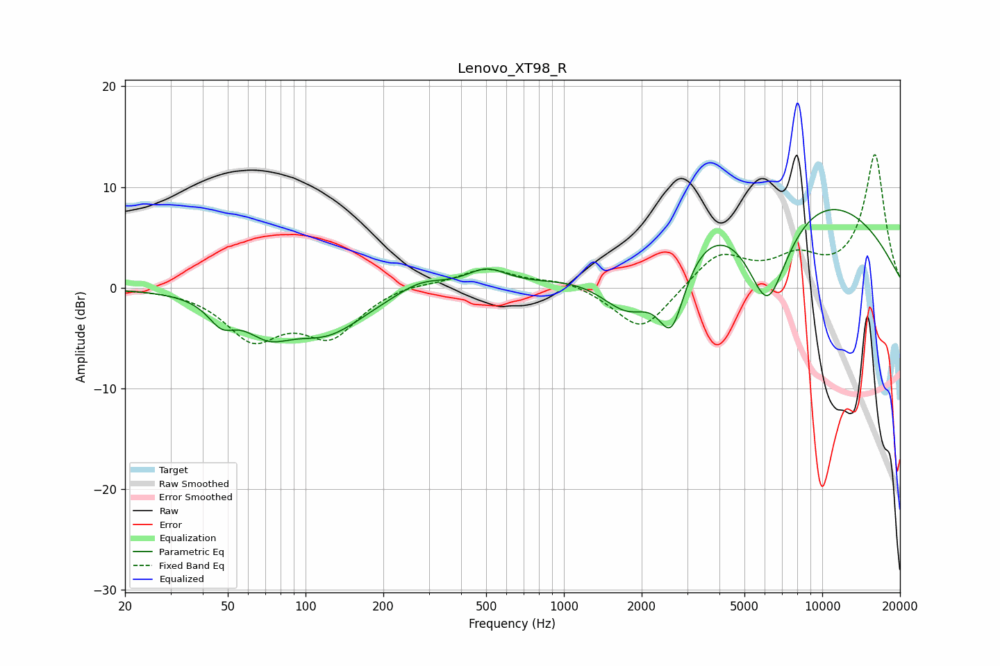

# Lenovo_XT98_R
See [usage instructions](https://github.com/jaakkopasanen/AutoEq#usage) for more options and info.

### Parametric EQs
Apply preamp of -7.8 dB when using parametric equalizer.

|   # | Type    |   Fc (Hz) |    Q |   Gain (dB) |
|-----|---------|-----------|------|-------------|
|   1 | Peaking |        47 | 2.73 |        -2.2 |
|   2 | Peaking |        71 | 1.54 |        -3.1 |
|   3 | Peaking |       121 | 0.96 |        -4   |
|   4 | Peaking |       280 | 1.38 |         1.6 |
|   5 | Peaking |       501 | 1.66 |         2.1 |
|   6 | Peaking |      1491 | 0.18 |        -1.9 |
|   7 | Peaking |      1782 | 1.18 |        -6.4 |
|   8 | Peaking |      2612 | 2.51 |        -7.7 |
|   9 | Peaking |      5757 | 0.25 |        13.6 |
|  10 | Peaking |      6138 | 1.42 |       -12.4 |

### Fixed Band EQs
When using fixed band (also called graphic) equalizer, apply preamp of **-13.3 dB** (if available) and set gains manually with these parameters.

|   # | Type    |   Fc (Hz) |    Q |   Gain (dB) |
|-----|---------|-----------|------|-------------|
|   1 | Peaking |        31 | 1.41 |         0   |
|   2 | Peaking |        62 | 1.41 |        -4.7 |
|   3 | Peaking |       125 | 1.41 |        -4.5 |
|   4 | Peaking |       250 | 1.41 |         0.5 |
|   5 | Peaking |       500 | 1.41 |         1.9 |
|   6 | Peaking |      1000 | 1.41 |         0.8 |
|   7 | Peaking |      2000 | 1.41 |        -4.5 |
|   8 | Peaking |      4000 | 1.41 |         3.4 |
|   9 | Peaking |      8000 | 1.41 |         2.5 |
|  10 | Peaking |     16000 | 1.41 |        13.2 |

### Graphs

