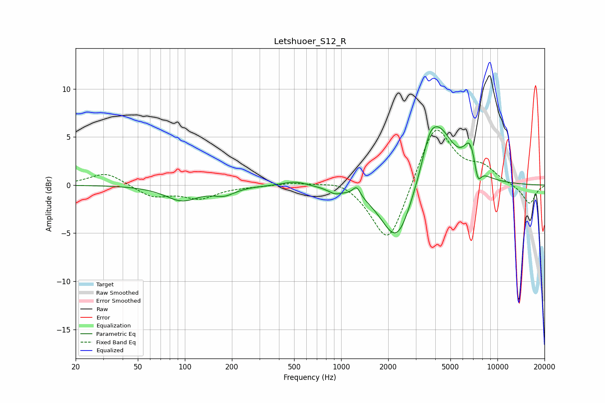

# Letshuoer_S12_R
See [usage instructions](https://github.com/jaakkopasanen/AutoEq#usage) for more options and info.

### Parametric EQs
Apply preamp of -6.2 dB when using parametric equalizer.

|   # | Type    |   Fc (Hz) |    Q |   Gain (dB) |
|-----|---------|-----------|------|-------------|
|   1 | Peaking |        96 | 1.32 |        -1.6 |
|   2 | Peaking |       179 | 2.06 |        -0.8 |
|   3 | Peaking |       506 | 1.74 |         0.5 |
|   4 | Peaking |       912 | 3.37 |        -0.5 |
|   5 | Peaking |      1256 | 6    |         1   |
|   6 | Peaking |      2280 | 1.39 |        -6.6 |
|   7 | Peaking |      3675 | 3.36 |         1.8 |
|   8 | Peaking |      4162 | 1.38 |         6.4 |
|   9 | Peaking |      6696 | 3.37 |         3.1 |
|  10 | Peaking |      7478 | 6    |        -2   |

### Fixed Band EQs
When using fixed band (also called graphic) equalizer, apply preamp of **-5.8 dB** (if available) and set gains manually with these parameters.

|   # | Type    |   Fc (Hz) |    Q |   Gain (dB) |
|-----|---------|-----------|------|-------------|
|   1 | Peaking |        31 | 1.41 |         1.4 |
|   2 | Peaking |        62 | 1.41 |        -1.2 |
|   3 | Peaking |       125 | 1.41 |        -1.3 |
|   4 | Peaking |       250 | 1.41 |        -0.1 |
|   5 | Peaking |       500 | 1.41 |         0.3 |
|   6 | Peaking |      1000 | 1.41 |         0.7 |
|   7 | Peaking |      2000 | 1.41 |        -6.5 |
|   8 | Peaking |      4000 | 1.41 |         6.6 |
|   9 | Peaking |      8000 | 1.41 |         1.6 |
|  10 | Peaking |     16000 | 1.41 |        -2   |

### Graphs

