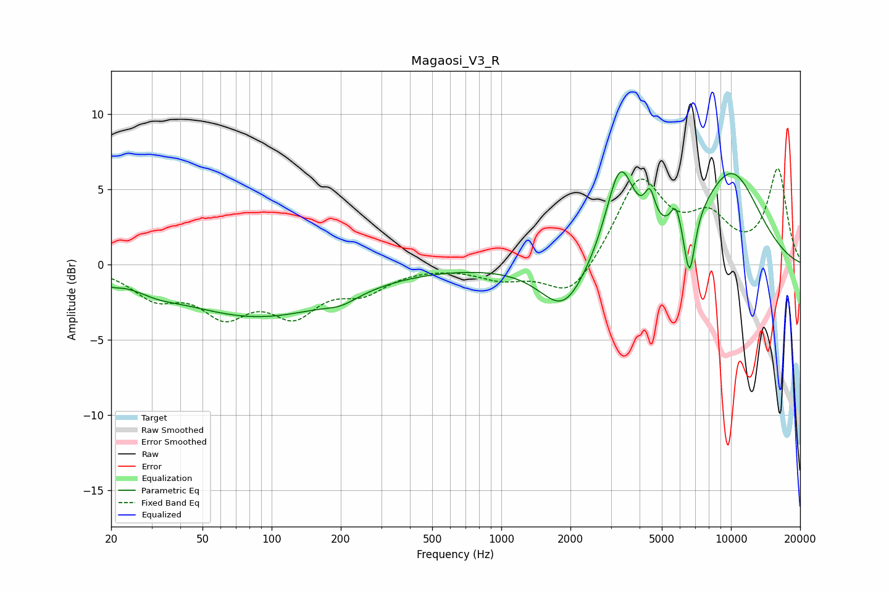

# Magaosi_V3_R
See [usage instructions](https://github.com/jaakkopasanen/AutoEq#usage) for more options and info.

### Parametric EQs
Apply preamp of -6.2 dB when using parametric equalizer.

|   # | Type    |   Fc (Hz) |    Q |   Gain (dB) |
|-----|---------|-----------|------|-------------|
|   1 | Peaking |        20 | 3.69 |        -0.4 |
|   2 | Peaking |        32 | 1.52 |        -0.5 |
|   3 | Peaking |        87 | 0.39 |        -3.4 |
|   4 | Peaking |       201 | 1.95 |        -0.5 |
|   5 | Peaking |      1872 | 1.39 |        -3.3 |
|   6 | Peaking |      3289 | 2.24 |         6.2 |
|   7 | Peaking |      4436 | 6    |         2.1 |
|   8 | Peaking |      5756 | 6    |         1.7 |
|   9 | Peaking |      6603 | 5.68 |        -4.2 |
|  10 | Peaking |     10000 | 0.86 |         6   |

### Fixed Band EQs
When using fixed band (also called graphic) equalizer, apply preamp of **-6.5 dB** (if available) and set gains manually with these parameters.

|   # | Type    |   Fc (Hz) |    Q |   Gain (dB) |
|-----|---------|-----------|------|-------------|
|   1 | Peaking |        31 | 1.41 |        -1.9 |
|   2 | Peaking |        62 | 1.41 |        -2.9 |
|   3 | Peaking |       125 | 1.41 |        -2.9 |
|   4 | Peaking |       250 | 1.41 |        -1.5 |
|   5 | Peaking |       500 | 1.41 |        -0   |
|   6 | Peaking |      1000 | 1.41 |        -0.9 |
|   7 | Peaking |      2000 | 1.41 |        -2.4 |
|   8 | Peaking |      4000 | 1.41 |         5.6 |
|   9 | Peaking |      8000 | 1.41 |         2.7 |
|  10 | Peaking |     16000 | 1.41 |         6.2 |

### Graphs

