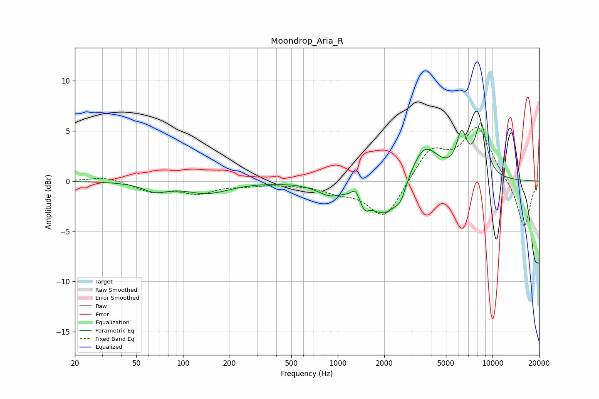

# Moondrop_Aria_R
See [usage instructions](https://github.com/jaakkopasanen/AutoEq#usage) for more options and info.

### Parametric EQs
Apply preamp of -5.9 dB when using parametric equalizer.

|   # | Type    |   Fc (Hz) |    Q |   Gain (dB) |
|-----|---------|-----------|------|-------------|
|   1 | Peaking |        66 | 1.79 |        -0.8 |
|   2 | Peaking |       143 | 0.99 |        -1.1 |
|   3 | Peaking |       887 | 1.73 |        -1   |
|   4 | Peaking |      1301 | 5.98 |         0.9 |
|   5 | Peaking |      1489 | 4.91 |        -1.2 |
|   6 | Peaking |      2025 | 1.37 |        -3.6 |
|   7 | Peaking |      2548 | 4.43 |        -1.2 |
|   8 | Peaking |      3613 | 1.53 |         3.9 |
|   9 | Peaking |      6317 | 4.07 |         3.7 |
|  10 | Peaking |      8420 | 3.46 |         5.2 |

### Fixed Band EQs
When using fixed band (also called graphic) equalizer, apply preamp of **-5.4 dB** (if available) and set gains manually with these parameters.

|   # | Type    |   Fc (Hz) |    Q |   Gain (dB) |
|-----|---------|-----------|------|-------------|
|   1 | Peaking |        31 | 1.41 |         0.5 |
|   2 | Peaking |        62 | 1.41 |        -1   |
|   3 | Peaking |       125 | 1.41 |        -1.1 |
|   4 | Peaking |       250 | 1.41 |        -0.3 |
|   5 | Peaking |       500 | 1.41 |        -0.2 |
|   6 | Peaking |      1000 | 1.41 |        -0.9 |
|   7 | Peaking |      2000 | 1.41 |        -3.8 |
|   8 | Peaking |      4000 | 1.41 |         3.1 |
|   9 | Peaking |      8000 | 1.41 |         5.2 |
|  10 | Peaking |     16000 | 1.41 |        -4.7 |

### Graphs

