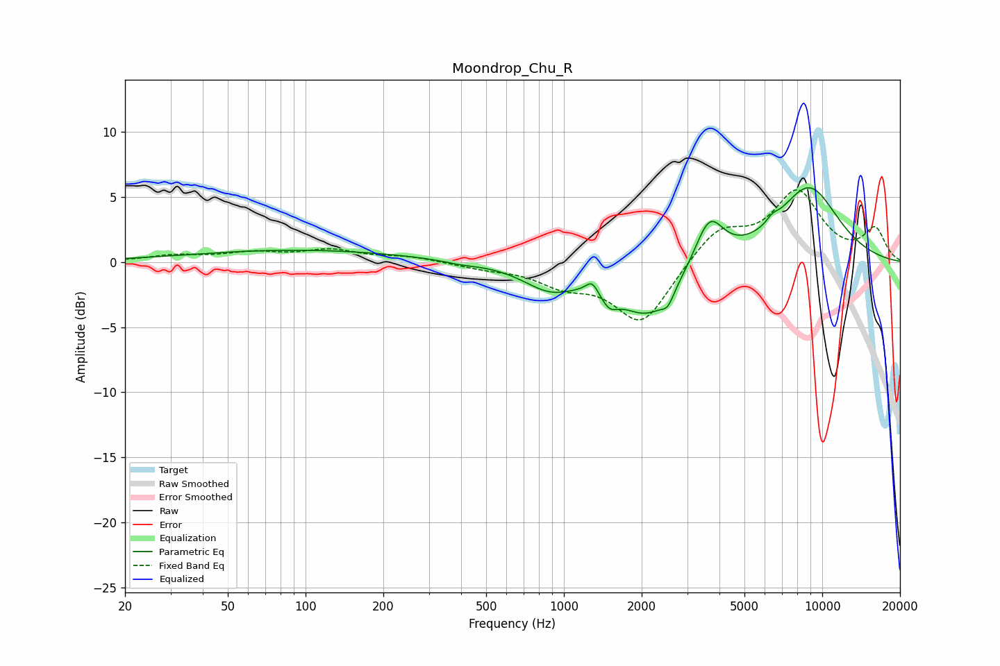

# Moondrop_Chu_R
See [usage instructions](https://github.com/jaakkopasanen/AutoEq#usage) for more options and info.

### Parametric EQs
Apply preamp of -5.8 dB when using parametric equalizer.

|   # | Type    |   Fc (Hz) |    Q |   Gain (dB) |
|-----|---------|-----------|------|-------------|
|   1 | Peaking |        95 | 0.34 |         0.9 |
|   2 | Peaking |       400 | 2.28 |        -0.2 |
|   3 | Peaking |       884 | 1.36 |        -1.8 |
|   4 | Peaking |      1287 | 5.99 |         0.9 |
|   5 | Peaking |      1499 | 4.19 |        -1.2 |
|   6 | Peaking |      2119 | 1.22 |        -4.1 |
|   7 | Peaking |      2525 | 6    |        -0.9 |
|   8 | Peaking |      3653 | 2.53 |         3.6 |
|   9 | Peaking |      6408 | 5.94 |         0.5 |
|  10 | Peaking |      8863 | 1.05 |         5.7 |

### Fixed Band EQs
When using fixed band (also called graphic) equalizer, apply preamp of **-5.6 dB** (if available) and set gains manually with these parameters.

|   # | Type    |   Fc (Hz) |    Q |   Gain (dB) |
|-----|---------|-----------|------|-------------|
|   1 | Peaking |        31 | 1.41 |         0.5 |
|   2 | Peaking |        62 | 1.41 |         0.6 |
|   3 | Peaking |       125 | 1.41 |         0.9 |
|   4 | Peaking |       250 | 1.41 |         0.4 |
|   5 | Peaking |       500 | 1.41 |        -0.4 |
|   6 | Peaking |      1000 | 1.41 |        -1.5 |
|   7 | Peaking |      2000 | 1.41 |        -4.7 |
|   8 | Peaking |      4000 | 1.41 |         2.5 |
|   9 | Peaking |      8000 | 1.41 |         5.2 |
|  10 | Peaking |     16000 | 1.41 |         2.4 |

### Graphs

