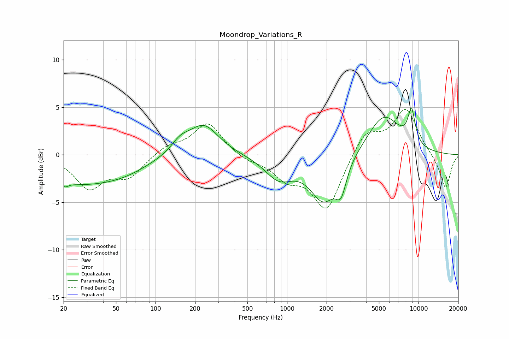

# Moondrop_Variations_R
See [usage instructions](https://github.com/jaakkopasanen/AutoEq#usage) for more options and info.

### Parametric EQs
Apply preamp of -5.0 dB when using parametric equalizer.

|   # | Type    |   Fc (Hz) |    Q |   Gain (dB) |
|-----|---------|-----------|------|-------------|
|   1 | Peaking |        20 | 5.54 |        -0.5 |
|   2 | Peaking |        24 | 0.55 |        -2.5 |
|   3 | Peaking |        56 | 0.67 |        -1.4 |
|   4 | Peaking |       154 | 2.05 |         1.1 |
|   5 | Peaking |       232 | 1.22 |         3.2 |
|   6 | Peaking |       866 | 1.32 |        -2.3 |
|   7 | Peaking |      1895 | 1.39 |        -4.6 |
|   8 | Peaking |      2579 | 3.52 |        -2.7 |
|   9 | Peaking |      5442 | 1.1  |         4.2 |
|  10 | Peaking |      8848 | 4.58 |         3.5 |

### Fixed Band EQs
When using fixed band (also called graphic) equalizer, apply preamp of **-4.9 dB** (if available) and set gains manually with these parameters.

|   # | Type    |   Fc (Hz) |    Q |   Gain (dB) |
|-----|---------|-----------|------|-------------|
|   1 | Peaking |        31 | 1.41 |        -3.4 |
|   2 | Peaking |        62 | 1.41 |        -2.2 |
|   3 | Peaking |       125 | 1.41 |         0.9 |
|   4 | Peaking |       250 | 1.41 |         3.4 |
|   5 | Peaking |       500 | 1.41 |        -0.6 |
|   6 | Peaking |      1000 | 1.41 |        -2.2 |
|   7 | Peaking |      2000 | 1.41 |        -5.8 |
|   8 | Peaking |      4000 | 1.41 |         2.6 |
|   9 | Peaking |      8000 | 1.41 |         4.8 |
|  10 | Peaking |     16000 | 1.41 |        -3.7 |

### Graphs

