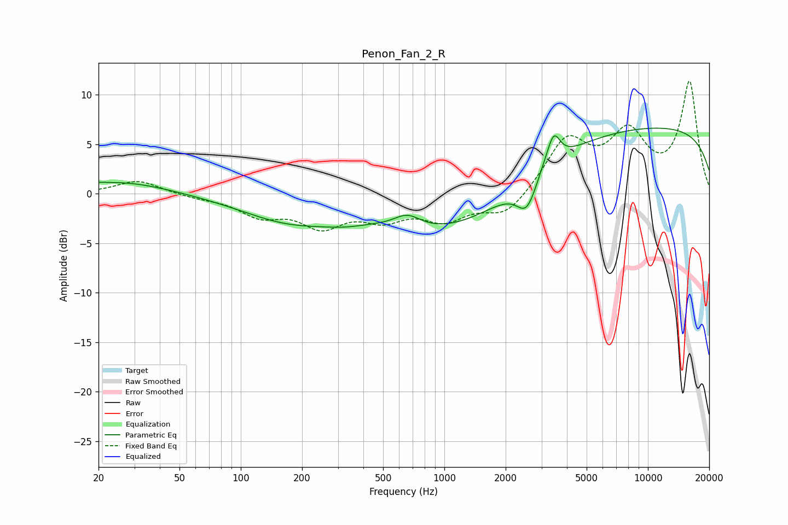

# Penon_Fan_2_R
See [usage instructions](https://github.com/jaakkopasanen/AutoEq#usage) for more options and info.

### Parametric EQs
Apply preamp of -6.7 dB when using parametric equalizer.

|   # | Type    |   Fc (Hz) |    Q |   Gain (dB) |
|-----|---------|-----------|------|-------------|
|   1 | Peaking |        20 | 5.8  |         0.1 |
|   2 | Peaking |        26 | 0.6  |         1.3 |
|   3 | Peaking |       174 | 0.58 |        -2.5 |
|   4 | Peaking |       322 | 1.32 |        -0.5 |
|   5 | Peaking |       658 | 2.16 |         1.3 |
|   6 | Peaking |      1099 | 0.43 |        -4.3 |
|   7 | Peaking |      2541 | 2.87 |        -3.2 |
|   8 | Peaking |      3086 | 3.88 |         0.5 |
|   9 | Peaking |      3446 | 4.49 |         3   |
|  10 | Peaking |     10000 | 0.18 |         6.8 |

### Fixed Band EQs
When using fixed band (also called graphic) equalizer, apply preamp of **-11.5 dB** (if available) and set gains manually with these parameters.

|   # | Type    |   Fc (Hz) |    Q |   Gain (dB) |
|-----|---------|-----------|------|-------------|
|   1 | Peaking |        31 | 1.41 |         1.4 |
|   2 | Peaking |        62 | 1.41 |        -0.3 |
|   3 | Peaking |       125 | 1.41 |        -2   |
|   4 | Peaking |       250 | 1.41 |        -2.9 |
|   5 | Peaking |       500 | 1.41 |        -2.1 |
|   6 | Peaking |      1000 | 1.41 |        -2.3 |
|   7 | Peaking |      2000 | 1.41 |        -2.3 |
|   8 | Peaking |      4000 | 1.41 |         5.3 |
|   9 | Peaking |      8000 | 1.41 |         5.6 |
|  10 | Peaking |     16000 | 1.41 |        11.1 |

### Graphs

