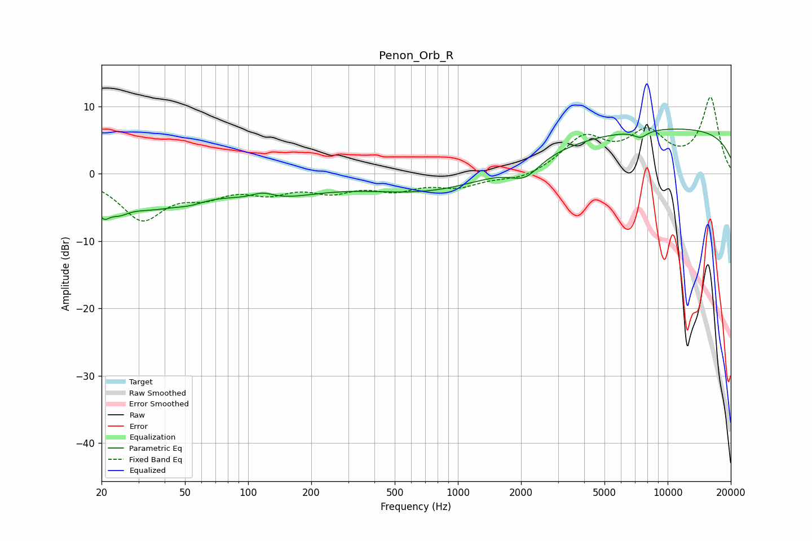

# Penon_Orb_R
See [usage instructions](https://github.com/jaakkopasanen/AutoEq#usage) for more options and info.

### Parametric EQs
Apply preamp of -6.7 dB when using parametric equalizer.

|   # | Type    |   Fc (Hz) |    Q |   Gain (dB) |
|-----|---------|-----------|------|-------------|
|   1 | Peaking |        20 | 4.4  |        -3.2 |
|   2 | Peaking |        24 | 2.86 |        -1.9 |
|   3 | Peaking |        33 | 0.87 |        -4.1 |
|   4 | Peaking |        53 | 1.85 |        -1   |
|   5 | Peaking |       117 | 2.67 |         1   |
|   6 | Peaking |       125 | 0.62 |        -3.1 |
|   7 | Peaking |       743 | 0.47 |        -2.9 |
|   8 | Peaking |      2088 | 2.01 |        -2.5 |
|   9 | Peaking |      7423 | 4.04 |        -1   |
|  10 | Peaking |     10000 | 0.18 |         6.8 |

### Fixed Band EQs
When using fixed band (also called graphic) equalizer, apply preamp of **-11.5 dB** (if available) and set gains manually with these parameters.

|   # | Type    |   Fc (Hz) |    Q |   Gain (dB) |
|-----|---------|-----------|------|-------------|
|   1 | Peaking |        31 | 1.41 |        -6.5 |
|   2 | Peaking |        62 | 1.41 |        -2.5 |
|   3 | Peaking |       125 | 1.41 |        -2.3 |
|   4 | Peaking |       250 | 1.41 |        -2.2 |
|   5 | Peaking |       500 | 1.41 |        -2   |
|   6 | Peaking |      1000 | 1.41 |        -1.7 |
|   7 | Peaking |      2000 | 1.41 |        -1   |
|   8 | Peaking |      4000 | 1.41 |         5.1 |
|   9 | Peaking |      8000 | 1.41 |         5.5 |
|  10 | Peaking |     16000 | 1.41 |        11.1 |

### Graphs

