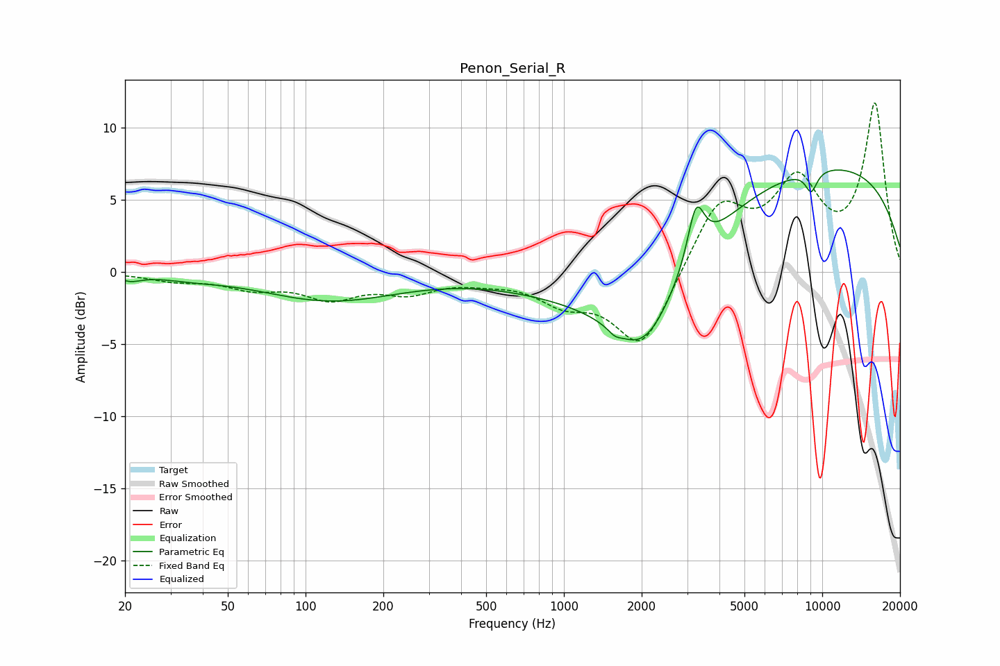

# Penon_Serial_R
See [usage instructions](https://github.com/jaakkopasanen/AutoEq#usage) for more options and info.

### Parametric EQs
Apply preamp of -7.2 dB when using parametric equalizer.

|   # | Type    |   Fc (Hz) |    Q |   Gain (dB) |
|-----|---------|-----------|------|-------------|
|   1 | Peaking |        21 | 3.42 |        -0.4 |
|   2 | Peaking |        36 | 1.31 |        -0.2 |
|   3 | Peaking |        91 | 4.03 |        -0   |
|   4 | Peaking |       125 | 0.54 |        -1.9 |
|   5 | Peaking |      1573 | 5.96 |        -0.4 |
|   6 | Peaking |      1604 | 0.44 |        -2.2 |
|   7 | Peaking |      2040 | 1.13 |        -5.1 |
|   8 | Peaking |      3245 | 4.39 |         3.8 |
|   9 | Peaking |      9065 | 5.49 |        -1.5 |
|  10 | Peaking |     10000 | 0.24 |         7.4 |

### Fixed Band EQs
When using fixed band (also called graphic) equalizer, apply preamp of **-11.8 dB** (if available) and set gains manually with these parameters.

|   # | Type    |   Fc (Hz) |    Q |   Gain (dB) |
|-----|---------|-----------|------|-------------|
|   1 | Peaking |        31 | 1.41 |        -0.5 |
|   2 | Peaking |        62 | 1.41 |        -1   |
|   3 | Peaking |       125 | 1.41 |        -1.6 |
|   4 | Peaking |       250 | 1.41 |        -1.2 |
|   5 | Peaking |       500 | 1.41 |        -0.4 |
|   6 | Peaking |      1000 | 1.41 |        -1.8 |
|   7 | Peaking |      2000 | 1.41 |        -5.4 |
|   8 | Peaking |      4000 | 1.41 |         4.8 |
|   9 | Peaking |      8000 | 1.41 |         5.7 |
|  10 | Peaking |     16000 | 1.41 |        11.5 |

### Graphs

