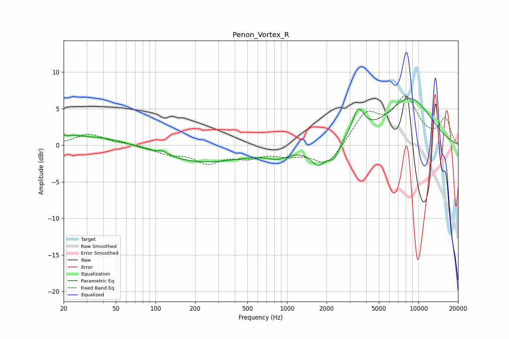

# Penon_Vortex_R
See [usage instructions](https://github.com/jaakkopasanen/AutoEq#usage) for more options and info.

### Parametric EQs
Apply preamp of -6.5 dB when using parametric equalizer.

|   # | Type    |   Fc (Hz) |    Q |   Gain (dB) |
|-----|---------|-----------|------|-------------|
|   1 | Peaking |        21 | 2.47 |         1.5 |
|   2 | Peaking |        21 | 3.45 |        -1   |
|   3 | Peaking |        40 | 0.49 |         1.4 |
|   4 | Peaking |       114 | 3.07 |         0.5 |
|   5 | Peaking |       214 | 0.39 |        -2.4 |
|   6 | Peaking |       855 | 1.63 |        -1.1 |
|   7 | Peaking |      1731 | 2.4  |        -2.6 |
|   8 | Peaking |      2271 | 3.76 |        -1.8 |
|   9 | Peaking |      3479 | 3.16 |         3.7 |
|  10 | Peaking |      8567 | 0.71 |         6.4 |

### Fixed Band EQs
When using fixed band (also called graphic) equalizer, apply preamp of **-6.9 dB** (if available) and set gains manually with these parameters.

|   # | Type    |   Fc (Hz) |    Q |   Gain (dB) |
|-----|---------|-----------|------|-------------|
|   1 | Peaking |        31 | 1.41 |         1.5 |
|   2 | Peaking |        62 | 1.41 |         0.2 |
|   3 | Peaking |       125 | 1.41 |        -1   |
|   4 | Peaking |       250 | 1.41 |        -2.2 |
|   5 | Peaking |       500 | 1.41 |        -1.4 |
|   6 | Peaking |      1000 | 1.41 |        -1   |
|   7 | Peaking |      2000 | 1.41 |        -2.9 |
|   8 | Peaking |      4000 | 1.41 |         4.1 |
|   9 | Peaking |      8000 | 1.41 |         6.1 |
|  10 | Peaking |     16000 | 1.41 |         3.5 |

### Graphs

