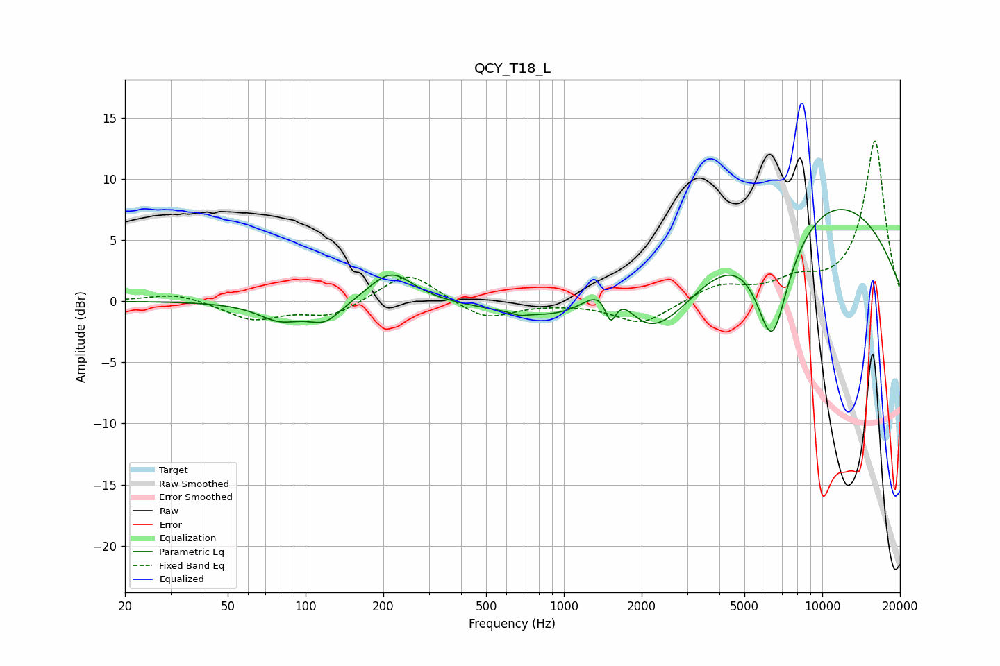

# QCY_T18_L
See [usage instructions](https://github.com/jaakkopasanen/AutoEq#usage) for more options and info.

### Parametric EQs
Apply preamp of -7.6 dB when using parametric equalizer.

|   # | Type    |   Fc (Hz) |    Q |   Gain (dB) |
|-----|---------|-----------|------|-------------|
|   1 | Peaking |        79 | 1.68 |        -1.4 |
|   2 | Peaking |       119 | 2.12 |        -1.6 |
|   3 | Peaking |       214 | 1.62 |         2.6 |
|   4 | Peaking |       674 | 5.16 |        -0.2 |
|   5 | Peaking |      1517 | 5.99 |        -2.7 |
|   6 | Peaking |      1526 | 1.36 |         6.7 |
|   7 | Peaking |      1982 | 0.62 |       -10.5 |
|   8 | Peaking |      6390 | 2.03 |        -9.7 |
|   9 | Peaking |      7572 | 0.25 |        10.2 |
|  10 | Peaking |      7931 | 1.2  |        -0.9 |

### Fixed Band EQs
When using fixed band (also called graphic) equalizer, apply preamp of **-13.2 dB** (if available) and set gains manually with these parameters.

|   # | Type    |   Fc (Hz) |    Q |   Gain (dB) |
|-----|---------|-----------|------|-------------|
|   1 | Peaking |        31 | 1.41 |         0.7 |
|   2 | Peaking |        62 | 1.41 |        -1.5 |
|   3 | Peaking |       125 | 1.41 |        -1.2 |
|   4 | Peaking |       250 | 1.41 |         2.5 |
|   5 | Peaking |       500 | 1.41 |        -1.5 |
|   6 | Peaking |      1000 | 1.41 |        -0.1 |
|   7 | Peaking |      2000 | 1.41 |        -1.9 |
|   8 | Peaking |      4000 | 1.41 |         1.3 |
|   9 | Peaking |      8000 | 1.41 |         1.4 |
|  10 | Peaking |     16000 | 1.41 |        13.1 |

### Graphs

