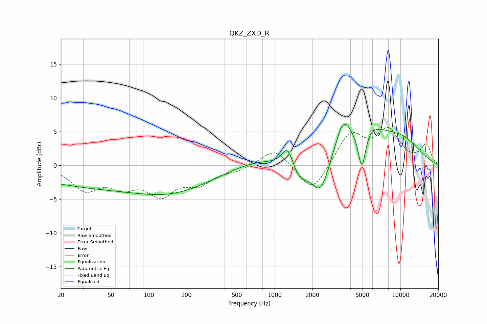

# QKZ_ZXD_R
See [usage instructions](https://github.com/jaakkopasanen/AutoEq#usage) for more options and info.

### Parametric EQs
Apply preamp of -6.2 dB when using parametric equalizer.

|   # | Type    |   Fc (Hz) |    Q |   Gain (dB) |
|-----|---------|-----------|------|-------------|
|   1 | Peaking |        61 | 0.18 |        -3.4 |
|   2 | Peaking |       156 | 0.53 |        -1.4 |
|   3 | Peaking |       692 | 0.72 |         1.1 |
|   4 | Peaking |      1266 | 3.27 |         3   |
|   5 | Peaking |      1596 | 2.17 |        -2.2 |
|   6 | Peaking |      2324 | 2.08 |        -5   |
|   7 | Peaking |      3484 | 2.3  |         4.6 |
|   8 | Peaking |      4939 | 4.4  |        -6.4 |
|   9 | Peaking |      5310 | 0.97 |         4.5 |
|  10 | Peaking |     10000 | 0.67 |         3.4 |

### Fixed Band EQs
When using fixed band (also called graphic) equalizer, apply preamp of **-5.7 dB** (if available) and set gains manually with these parameters.

|   # | Type    |   Fc (Hz) |    Q |   Gain (dB) |
|-----|---------|-----------|------|-------------|
|   1 | Peaking |        31 | 1.41 |        -3.4 |
|   2 | Peaking |        62 | 1.41 |        -2.6 |
|   3 | Peaking |       125 | 1.41 |        -3.9 |
|   4 | Peaking |       250 | 1.41 |        -2.4 |
|   5 | Peaking |       500 | 1.41 |        -0.7 |
|   6 | Peaking |      1000 | 1.41 |         2.6 |
|   7 | Peaking |      2000 | 1.41 |        -4.3 |
|   8 | Peaking |      4000 | 1.41 |         4.7 |
|   9 | Peaking |      8000 | 1.41 |         4.9 |
|  10 | Peaking |     16000 | 1.41 |         2.9 |

### Graphs

