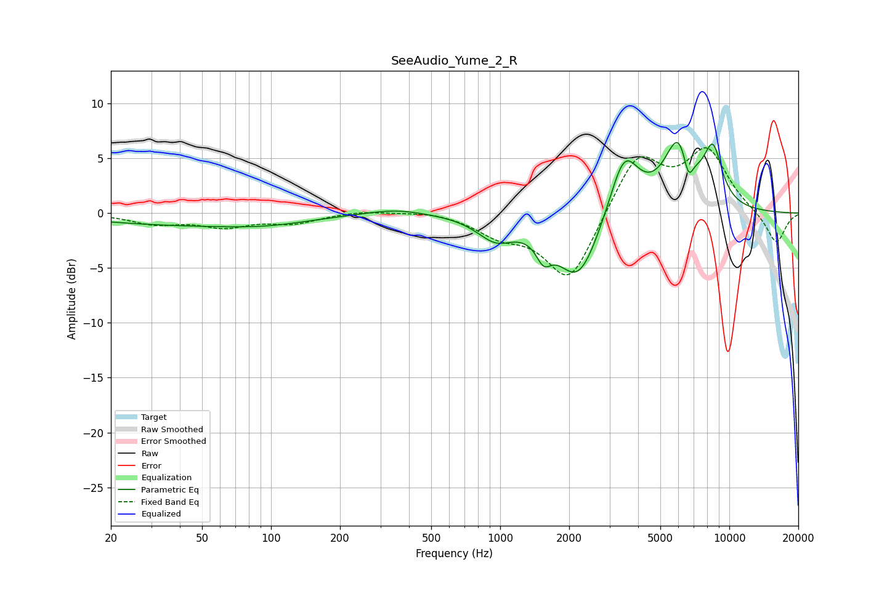

# SeeAudio_Yume_2_R
See [usage instructions](https://github.com/jaakkopasanen/AutoEq#usage) for more options and info.

### Parametric EQs
Apply preamp of -6.5 dB when using parametric equalizer.

|   # | Type    |   Fc (Hz) |    Q |   Gain (dB) |
|-----|---------|-----------|------|-------------|
|   1 | Peaking |        40 | 0.36 |        -1   |
|   2 | Peaking |        98 | 0.74 |        -0.5 |
|   3 | Peaking |       349 | 1.09 |         0.5 |
|   4 | Peaking |       956 | 1.74 |        -2.1 |
|   5 | Peaking |      1547 | 4.27 |        -1.9 |
|   6 | Peaking |      2194 | 1.5  |        -6.2 |
|   7 | Peaking |      3474 | 2.15 |         5.8 |
|   8 | Peaking |      6046 | 2.12 |         6.5 |
|   9 | Peaking |      6623 | 5.99 |        -2.7 |
|  10 | Peaking |      8492 | 3.22 |         4.8 |

### Fixed Band EQs
When using fixed band (also called graphic) equalizer, apply preamp of **-6.1 dB** (if available) and set gains manually with these parameters.

|   # | Type    |   Fc (Hz) |    Q |   Gain (dB) |
|-----|---------|-----------|------|-------------|
|   1 | Peaking |        31 | 1.41 |        -0.9 |
|   2 | Peaking |        62 | 1.41 |        -1.1 |
|   3 | Peaking |       125 | 1.41 |        -0.8 |
|   4 | Peaking |       250 | 1.41 |         0.3 |
|   5 | Peaking |       500 | 1.41 |         0.3 |
|   6 | Peaking |      1000 | 1.41 |        -1.7 |
|   7 | Peaking |      2000 | 1.41 |        -6.4 |
|   8 | Peaking |      4000 | 1.41 |         5.4 |
|   9 | Peaking |      8000 | 1.41 |         5.5 |
|  10 | Peaking |     16000 | 1.41 |        -2.9 |

### Graphs

