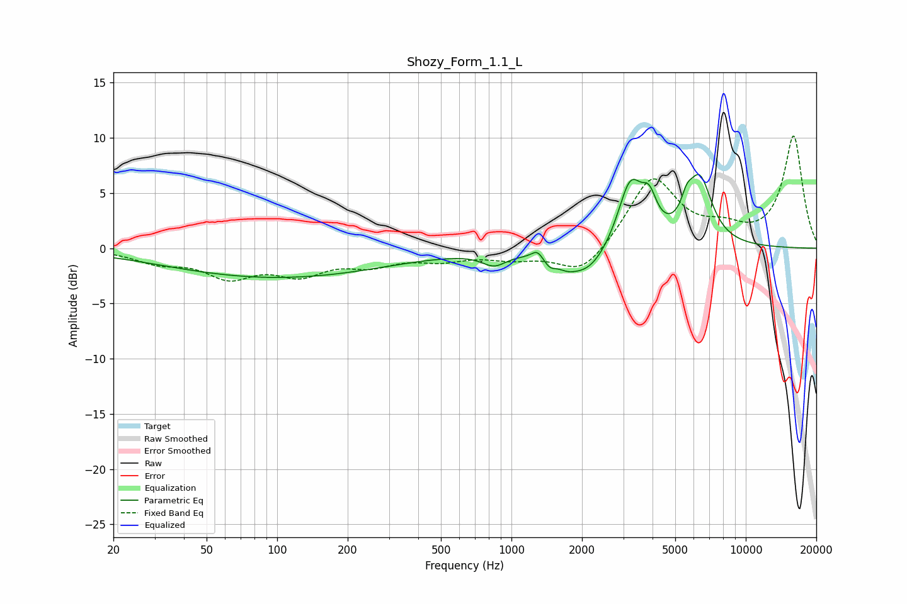

# Shozy_Form_1.1_L
See [usage instructions](https://github.com/jaakkopasanen/AutoEq#usage) for more options and info.

### Parametric EQs
Apply preamp of -6.8 dB when using parametric equalizer.

|   # | Type    |   Fc (Hz) |    Q |   Gain (dB) |
|-----|---------|-----------|------|-------------|
|   1 | Peaking |        99 | 0.3  |        -2.6 |
|   2 | Peaking |       843 | 2.75 |        -1.1 |
|   3 | Peaking |      1290 | 6    |         0.8 |
|   4 | Peaking |      1459 | 5.39 |        -0.8 |
|   5 | Peaking |      1724 | 3.68 |        -0.5 |
|   6 | Peaking |      2106 | 1.5  |        -2.6 |
|   7 | Peaking |      3217 | 2.6  |         6.1 |
|   8 | Peaking |      3876 | 4.42 |         2.6 |
|   9 | Peaking |      5597 | 5.96 |         1.5 |
|  10 | Peaking |      6354 | 2.59 |         6   |

### Fixed Band EQs
When using fixed band (also called graphic) equalizer, apply preamp of **-10.3 dB** (if available) and set gains manually with these parameters.

|   # | Type    |   Fc (Hz) |    Q |   Gain (dB) |
|-----|---------|-----------|------|-------------|
|   1 | Peaking |        31 | 1.41 |        -1.1 |
|   2 | Peaking |        62 | 1.41 |        -2.3 |
|   3 | Peaking |       125 | 1.41 |        -2.1 |
|   4 | Peaking |       250 | 1.41 |        -1.3 |
|   5 | Peaking |       500 | 1.41 |        -0.9 |
|   6 | Peaking |      1000 | 1.41 |        -0.8 |
|   7 | Peaking |      2000 | 1.41 |        -2.6 |
|   8 | Peaking |      4000 | 1.41 |         6.4 |
|   9 | Peaking |      8000 | 1.41 |         1.3 |
|  10 | Peaking |     16000 | 1.41 |        10.1 |

### Graphs

