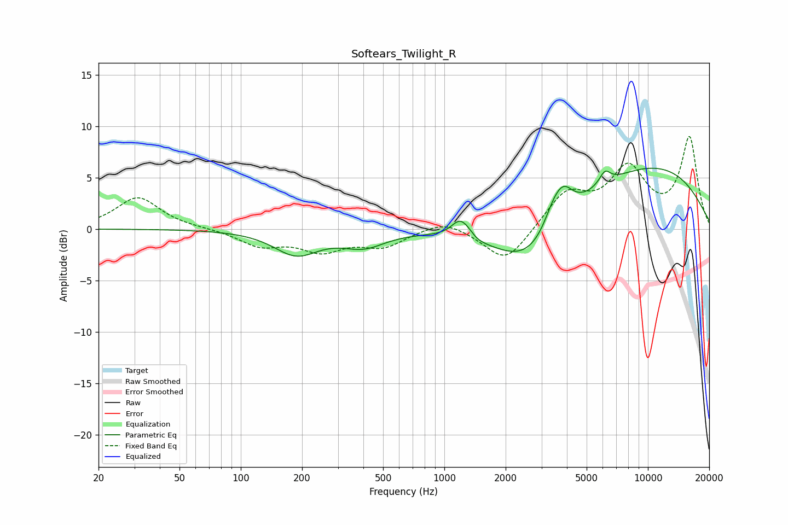

# Softears_Twilight_R
See [usage instructions](https://github.com/jaakkopasanen/AutoEq#usage) for more options and info.

### Parametric EQs
Apply preamp of -6.0 dB when using parametric equalizer.

|   # | Type    |   Fc (Hz) |    Q |   Gain (dB) |
|-----|---------|-----------|------|-------------|
|   1 | Peaking |       187 | 1.29 |        -2.4 |
|   2 | Peaking |       402 | 1.34 |        -1.5 |
|   3 | Peaking |      1186 | 3.43 |         1.4 |
|   4 | Peaking |      1306 | 3.14 |         1   |
|   5 | Peaking |      1390 | 2.91 |        -0.7 |
|   6 | Peaking |      2609 | 0.81 |        -4.5 |
|   7 | Peaking |      3401 | 3.03 |         1.6 |
|   8 | Peaking |      3835 | 2.8  |         2.9 |
|   9 | Peaking |      6149 | 4.87 |         1.3 |
|  10 | Peaking |     10000 | 0.33 |         6.1 |

### Fixed Band EQs
When using fixed band (also called graphic) equalizer, apply preamp of **-9.1 dB** (if available) and set gains manually with these parameters.

|   # | Type    |   Fc (Hz) |    Q |   Gain (dB) |
|-----|---------|-----------|------|-------------|
|   1 | Peaking |        31 | 1.41 |         3.1 |
|   2 | Peaking |        62 | 1.41 |         0   |
|   3 | Peaking |       125 | 1.41 |        -1.5 |
|   4 | Peaking |       250 | 1.41 |        -1.9 |
|   5 | Peaking |       500 | 1.41 |        -1.6 |
|   6 | Peaking |      1000 | 1.41 |         1   |
|   7 | Peaking |      2000 | 1.41 |        -3.4 |
|   8 | Peaking |      4000 | 1.41 |         3.4 |
|   9 | Peaking |      8000 | 1.41 |         5.5 |
|  10 | Peaking |     16000 | 1.41 |         8.7 |

### Graphs

