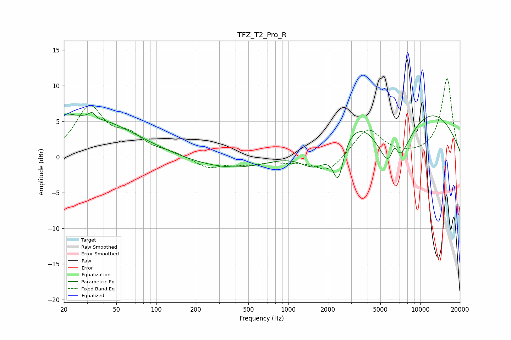

# TFZ_T2_Pro_R
See [usage instructions](https://github.com/jaakkopasanen/AutoEq#usage) for more options and info.

### Parametric EQs
Apply preamp of -6.3 dB when using parametric equalizer.

|   # | Type    |   Fc (Hz) |    Q |   Gain (dB) |
|-----|---------|-----------|------|-------------|
|   1 | Peaking |        20 | 2.14 |         1.3 |
|   2 | Peaking |        31 | 0.41 |         5.4 |
|   3 | Peaking |        33 | 5.09 |         2.1 |
|   4 | Peaking |        34 | 4.66 |        -1.5 |
|   5 | Peaking |       536 | 0.36 |        -2.5 |
|   6 | Peaking |      1634 | 1.06 |        -5.5 |
|   7 | Peaking |      2395 | 3.37 |        -5.9 |
|   8 | Peaking |      5651 | 0.22 |        11.6 |
|   9 | Peaking |      6262 | 1.08 |       -14.1 |
|  10 | Peaking |      6368 | 4.17 |         4.3 |

### Fixed Band EQs
When using fixed band (also called graphic) equalizer, apply preamp of **-11.1 dB** (if available) and set gains manually with these parameters.

|   # | Type    |   Fc (Hz) |    Q |   Gain (dB) |
|-----|---------|-----------|------|-------------|
|   1 | Peaking |        31 | 1.41 |         6.8 |
|   2 | Peaking |        62 | 1.41 |         2.5 |
|   3 | Peaking |       125 | 1.41 |         0.6 |
|   4 | Peaking |       250 | 1.41 |        -1.5 |
|   5 | Peaking |       500 | 1.41 |        -0.9 |
|   6 | Peaking |      1000 | 1.41 |        -0.5 |
|   7 | Peaking |      2000 | 1.41 |        -2.2 |
|   8 | Peaking |      4000 | 1.41 |         4   |
|   9 | Peaking |      8000 | 1.41 |         0   |
|  10 | Peaking |     16000 | 1.41 |        11   |

### Graphs

