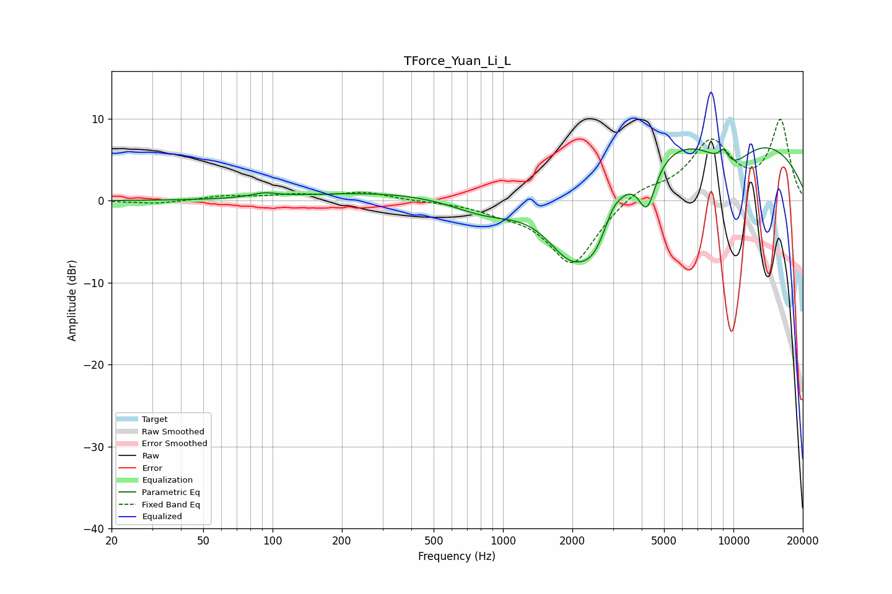

# TForce_Yuan_Li_L
See [usage instructions](https://github.com/jaakkopasanen/AutoEq#usage) for more options and info.

### Parametric EQs
Apply preamp of -6.6 dB when using parametric equalizer.

|   # | Type    |   Fc (Hz) |    Q |   Gain (dB) |
|-----|---------|-----------|------|-------------|
|   1 | Peaking |        92 | 2.64 |         0.5 |
|   2 | Peaking |       695 | 0.18 |         1.4 |
|   3 | Peaking |       858 | 0.82 |        -3.2 |
|   4 | Peaking |      1961 | 1.03 |       -11.2 |
|   5 | Peaking |      2500 | 2    |        -5.1 |
|   6 | Peaking |      2997 | 5.33 |         0.7 |
|   7 | Peaking |      4217 | 3.54 |        -5.9 |
|   8 | Peaking |      6977 | 0.18 |         9.5 |
|   9 | Peaking |      9084 | 5.72 |         1.7 |
|  10 | Peaking |      9592 | 1.24 |        -4.3 |

### Fixed Band EQs
When using fixed band (also called graphic) equalizer, apply preamp of **-10.0 dB** (if available) and set gains manually with these parameters.

|   # | Type    |   Fc (Hz) |    Q |   Gain (dB) |
|-----|---------|-----------|------|-------------|
|   1 | Peaking |        31 | 1.41 |        -0.4 |
|   2 | Peaking |        62 | 1.41 |         0.6 |
|   3 | Peaking |       125 | 1.41 |         0.6 |
|   4 | Peaking |       250 | 1.41 |         1   |
|   5 | Peaking |       500 | 1.41 |        -0   |
|   6 | Peaking |      1000 | 1.41 |        -0.9 |
|   7 | Peaking |      2000 | 1.41 |        -7.9 |
|   8 | Peaking |      4000 | 1.41 |         1.6 |
|   9 | Peaking |      8000 | 1.41 |         7   |
|  10 | Peaking |     16000 | 1.41 |         9.6 |

### Graphs

