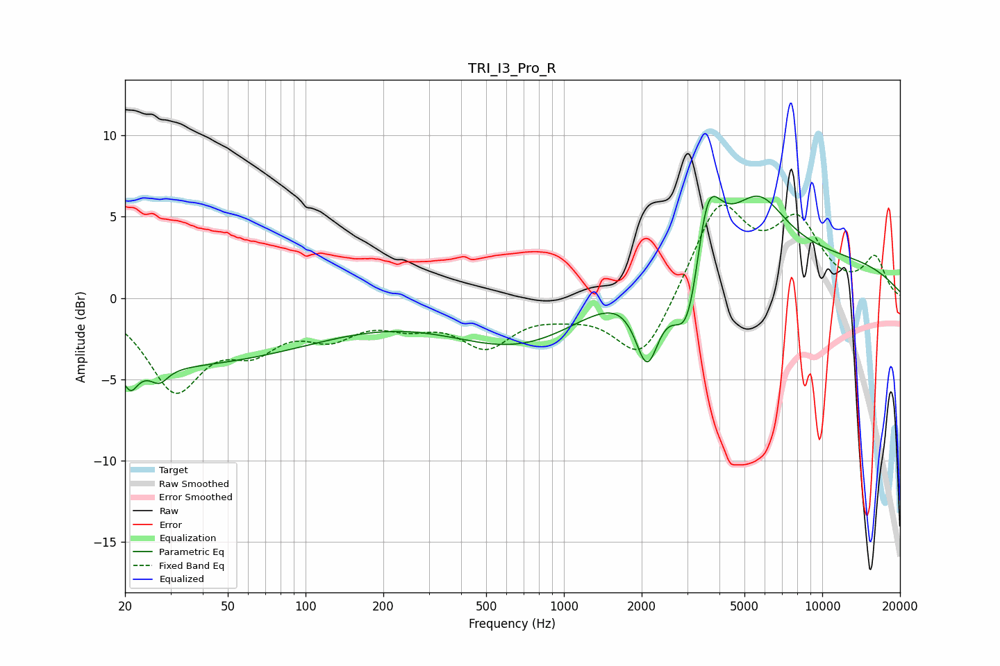

# TRI_I3_Pro_R
See [usage instructions](https://github.com/jaakkopasanen/AutoEq#usage) for more options and info.

### Parametric EQs
Apply preamp of -6.4 dB when using parametric equalizer.

|   # | Type    |   Fc (Hz) |    Q |   Gain (dB) |
|-----|---------|-----------|------|-------------|
|   1 | Peaking |        21 | 5.16 |        -1.4 |
|   2 | Peaking |        23 | 0.18 |        -4.2 |
|   3 | Peaking |        27 | 4.24 |        -0.9 |
|   4 | Peaking |       718 | 0.5  |        -3.3 |
|   5 | Peaking |      2100 | 3.01 |        -4.8 |
|   6 | Peaking |      2681 | 0.56 |         1.1 |
|   7 | Peaking |      3052 | 2.25 |        -6.8 |
|   8 | Peaking |      3569 | 2.65 |         6.3 |
|   9 | Peaking |      5684 | 1.35 |         3.3 |
|  10 | Peaking |      6724 | 0.18 |         2.5 |

### Fixed Band EQs
When using fixed band (also called graphic) equalizer, apply preamp of **-5.8 dB** (if available) and set gains manually with these parameters.

|   # | Type    |   Fc (Hz) |    Q |   Gain (dB) |
|-----|---------|-----------|------|-------------|
|   1 | Peaking |        31 | 1.41 |        -5.3 |
|   2 | Peaking |        62 | 1.41 |        -2.4 |
|   3 | Peaking |       125 | 1.41 |        -1.9 |
|   4 | Peaking |       250 | 1.41 |        -1.2 |
|   5 | Peaking |       500 | 1.41 |        -2.7 |
|   6 | Peaking |      1000 | 1.41 |        -0.5 |
|   7 | Peaking |      2000 | 1.41 |        -4   |
|   8 | Peaking |      4000 | 1.41 |         5.7 |
|   9 | Peaking |      8000 | 1.41 |         4.3 |
|  10 | Peaking |     16000 | 1.41 |         2.4 |

### Graphs

