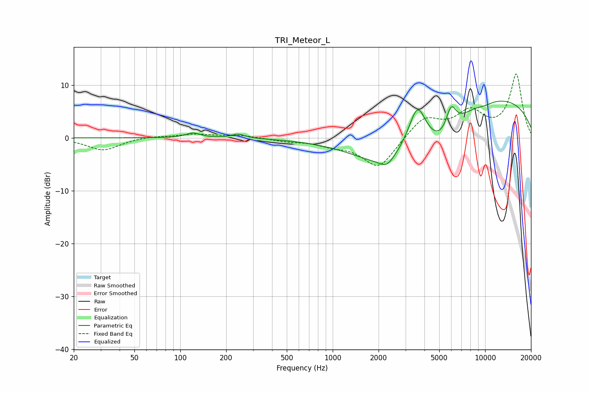

# TRI_Meteor_L
See [usage instructions](https://github.com/jaakkopasanen/AutoEq#usage) for more options and info.

### Parametric EQs
Apply preamp of -7.0 dB when using parametric equalizer.

|   # | Type    |   Fc (Hz) |    Q |   Gain (dB) |
|-----|---------|-----------|------|-------------|
|   1 | Peaking |       121 | 3.03 |         0.9 |
|   2 | Peaking |       240 | 3.29 |         0.8 |
|   3 | Peaking |      2272 | 2.93 |        -1.7 |
|   4 | Peaking |      2283 | 0.63 |        -7.1 |
|   5 | Peaking |      3597 | 2.41 |         8   |
|   6 | Peaking |      5122 | 1.13 |        -5.5 |
|   7 | Peaking |      5979 | 4.09 |         4.6 |
|   8 | Peaking |      9833 | 0.23 |         8   |
|   9 | Peaking |     10000 | 2.78 |        -1.2 |
|  10 | Peaking |     10000 | 2.88 |         0.8 |

### Fixed Band EQs
When using fixed band (also called graphic) equalizer, apply preamp of **-12.2 dB** (if available) and set gains manually with these parameters.

|   # | Type    |   Fc (Hz) |    Q |   Gain (dB) |
|-----|---------|-----------|------|-------------|
|   1 | Peaking |        31 | 1.41 |        -2.4 |
|   2 | Peaking |        62 | 1.41 |         0.3 |
|   3 | Peaking |       125 | 1.41 |         0.7 |
|   4 | Peaking |       250 | 1.41 |         0.5 |
|   5 | Peaking |       500 | 1.41 |        -0.5 |
|   6 | Peaking |      1000 | 1.41 |        -1.1 |
|   7 | Peaking |      2000 | 1.41 |        -5.8 |
|   8 | Peaking |      4000 | 1.41 |         3.9 |
|   9 | Peaking |      8000 | 1.41 |         4.5 |
|  10 | Peaking |     16000 | 1.41 |        11.9 |

### Graphs

