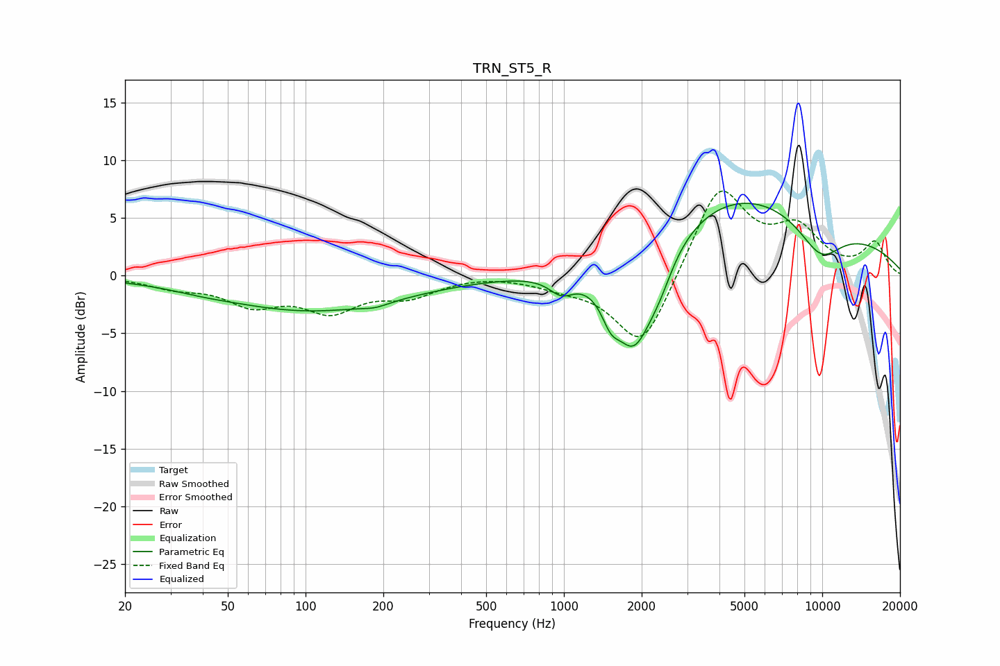

# TRN_ST5_R
See [usage instructions](https://github.com/jaakkopasanen/AutoEq#usage) for more options and info.

### Parametric EQs
Apply preamp of -6.4 dB when using parametric equalizer.

|   # | Type    |   Fc (Hz) |    Q |   Gain (dB) |
|-----|---------|-----------|------|-------------|
|   1 | Peaking |        40 | 1.19 |        -0.2 |
|   2 | Peaking |       106 | 0.4  |        -3   |
|   3 | Peaking |       186 | 2.75 |        -0.3 |
|   4 | Peaking |       978 | 2.95 |        -1.4 |
|   5 | Peaking |      1516 | 4.09 |        -1.9 |
|   6 | Peaking |      1872 | 1.7  |        -8.7 |
|   7 | Peaking |      2353 | 2.72 |        -1.8 |
|   8 | Peaking |      4447 | 0.46 |         4.5 |
|   9 | Peaking |      8171 | 0.21 |         3.1 |
|  10 | Peaking |      9836 | 1.42 |        -3.3 |

### Fixed Band EQs
When using fixed band (also called graphic) equalizer, apply preamp of **-7.4 dB** (if available) and set gains manually with these parameters.

|   # | Type    |   Fc (Hz) |    Q |   Gain (dB) |
|-----|---------|-----------|------|-------------|
|   1 | Peaking |        31 | 1.41 |        -0.9 |
|   2 | Peaking |        62 | 1.41 |        -2.2 |
|   3 | Peaking |       125 | 1.41 |        -2.7 |
|   4 | Peaking |       250 | 1.41 |        -1.5 |
|   5 | Peaking |       500 | 1.41 |         0.2 |
|   6 | Peaking |      1000 | 1.41 |        -0.7 |
|   7 | Peaking |      2000 | 1.41 |        -6.6 |
|   8 | Peaking |      4000 | 1.41 |         7.9 |
|   9 | Peaking |      8000 | 1.41 |         3.6 |
|  10 | Peaking |     16000 | 1.41 |         2.8 |

### Graphs

