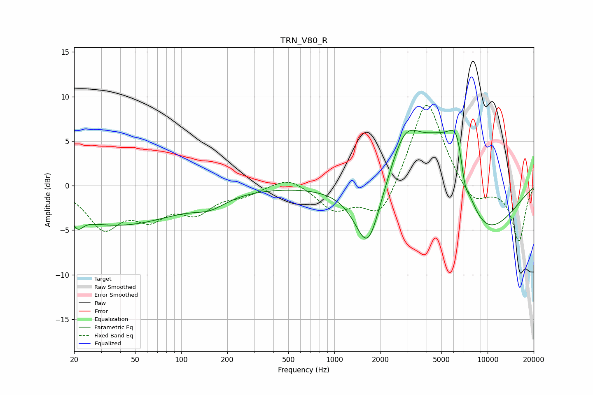

# TRN_V80_R
See [usage instructions](https://github.com/jaakkopasanen/AutoEq#usage) for more options and info.

### Parametric EQs
Apply preamp of -6.3 dB when using parametric equalizer.

|   # | Type    |   Fc (Hz) |    Q |   Gain (dB) |
|-----|---------|-----------|------|-------------|
|   1 | Peaking |        21 | 4.57 |        -1.2 |
|   2 | Peaking |        38 | 0.34 |        -4.4 |
|   3 | Peaking |       154 | 1.34 |        -1.2 |
|   4 | Peaking |      1653 | 1.63 |        -7.8 |
|   5 | Peaking |      2897 | 1.26 |         6.6 |
|   6 | Peaking |      4665 | 0.87 |         4.4 |
|   7 | Peaking |      4812 | 1.22 |         2.3 |
|   8 | Peaking |      6379 | 1.86 |         8.6 |
|   9 | Peaking |      7067 | 4.83 |        -2.7 |
|  10 | Peaking |      7808 | 0.51 |        -8.2 |

### Fixed Band EQs
When using fixed band (also called graphic) equalizer, apply preamp of **-9.1 dB** (if available) and set gains manually with these parameters.

|   # | Type    |   Fc (Hz) |    Q |   Gain (dB) |
|-----|---------|-----------|------|-------------|
|   1 | Peaking |        31 | 1.41 |        -4.5 |
|   2 | Peaking |        62 | 1.41 |        -3   |
|   3 | Peaking |       125 | 1.41 |        -2.6 |
|   4 | Peaking |       250 | 1.41 |        -0.9 |
|   5 | Peaking |       500 | 1.41 |         1.2 |
|   6 | Peaking |      1000 | 1.41 |        -2.7 |
|   7 | Peaking |      2000 | 1.41 |        -4   |
|   8 | Peaking |      4000 | 1.41 |        10.2 |
|   9 | Peaking |      8000 | 1.41 |        -2.4 |
|  10 | Peaking |     16000 | 1.41 |        -6.2 |

### Graphs

