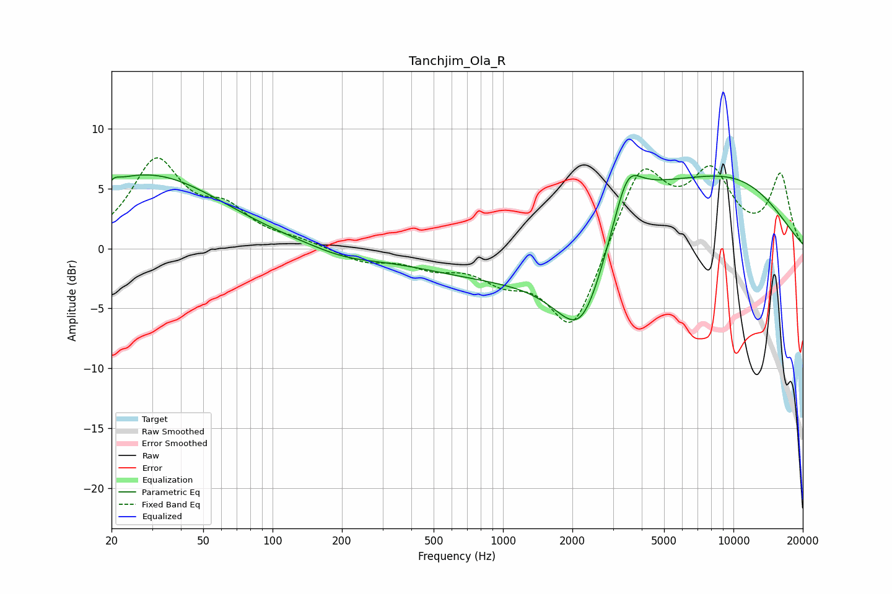

# Tanchjim_Ola_R
See [usage instructions](https://github.com/jaakkopasanen/AutoEq#usage) for more options and info.

### Parametric EQs
Apply preamp of -6.3 dB when using parametric equalizer.

|   # | Type    |   Fc (Hz) |    Q |   Gain (dB) |
|-----|---------|-----------|------|-------------|
|   1 | Peaking |        20 | 0.7  |         1.3 |
|   2 | Peaking |        20 | 5.77 |        -3.1 |
|   3 | Peaking |        20 | 5.89 |         3.3 |
|   4 | Peaking |        32 | 0.47 |         5.2 |
|   5 | Peaking |       205 | 0.99 |        -0.7 |
|   6 | Peaking |       970 | 0.39 |        -2.2 |
|   7 | Peaking |      2214 | 1.08 |        -9.8 |
|   8 | Peaking |      3388 | 0.63 |         5.9 |
|   9 | Peaking |      3460 | 2.46 |         3.6 |
|  10 | Peaking |      9908 | 0.45 |         5.1 |

### Fixed Band EQs
When using fixed band (also called graphic) equalizer, apply preamp of **-7.7 dB** (if available) and set gains manually with these parameters.

|   # | Type    |   Fc (Hz) |    Q |   Gain (dB) |
|-----|---------|-----------|------|-------------|
|   1 | Peaking |        31 | 1.41 |         7.1 |
|   2 | Peaking |        62 | 1.41 |         2.7 |
|   3 | Peaking |       125 | 1.41 |         0.5 |
|   4 | Peaking |       250 | 1.41 |        -1   |
|   5 | Peaking |       500 | 1.41 |        -1.3 |
|   6 | Peaking |      1000 | 1.41 |        -2.1 |
|   7 | Peaking |      2000 | 1.41 |        -7.1 |
|   8 | Peaking |      4000 | 1.41 |         7   |
|   9 | Peaking |      8000 | 1.41 |         5.8 |
|  10 | Peaking |     16000 | 1.41 |         6   |

### Graphs

