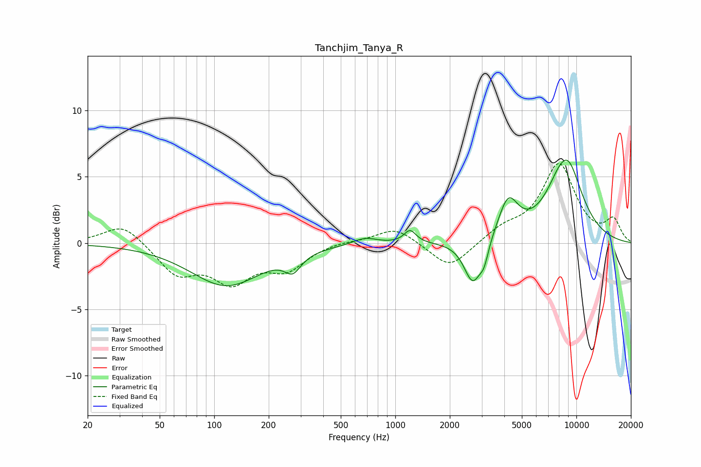

# Tanchjim_Tanya_R
See [usage instructions](https://github.com/jaakkopasanen/AutoEq#usage) for more options and info.

### Parametric EQs
Apply preamp of -6.4 dB when using parametric equalizer.

|   # | Type    |   Fc (Hz) |    Q |   Gain (dB) |
|-----|---------|-----------|------|-------------|
|   1 | Peaking |       116 | 0.72 |        -3.2 |
|   2 | Peaking |       272 | 3.17 |        -1.2 |
|   3 | Peaking |       579 | 2.41 |         0   |
|   4 | Peaking |       681 | 2.15 |         0.5 |
|   5 | Peaking |      1207 | 4.36 |         1   |
|   6 | Peaking |      2680 | 2.92 |        -3.3 |
|   7 | Peaking |      3096 | 5.82 |        -1.2 |
|   8 | Peaking |      4199 | 2.56 |         3   |
|   9 | Peaking |      8463 | 3.02 |        -0.5 |
|  10 | Peaking |      8688 | 1.43 |         6.7 |

### Fixed Band EQs
When using fixed band (also called graphic) equalizer, apply preamp of **-6.1 dB** (if available) and set gains manually with these parameters.

|   # | Type    |   Fc (Hz) |    Q |   Gain (dB) |
|-----|---------|-----------|------|-------------|
|   1 | Peaking |        31 | 1.41 |         1.5 |
|   2 | Peaking |        62 | 1.41 |        -2.2 |
|   3 | Peaking |       125 | 1.41 |        -2.6 |
|   4 | Peaking |       250 | 1.41 |        -1.8 |
|   5 | Peaking |       500 | 1.41 |         0.2 |
|   6 | Peaking |      1000 | 1.41 |         1.2 |
|   7 | Peaking |      2000 | 1.41 |        -2   |
|   8 | Peaking |      4000 | 1.41 |         1   |
|   9 | Peaking |      8000 | 1.41 |         5.8 |
|  10 | Peaking |     16000 | 1.41 |         1.6 |

### Graphs

