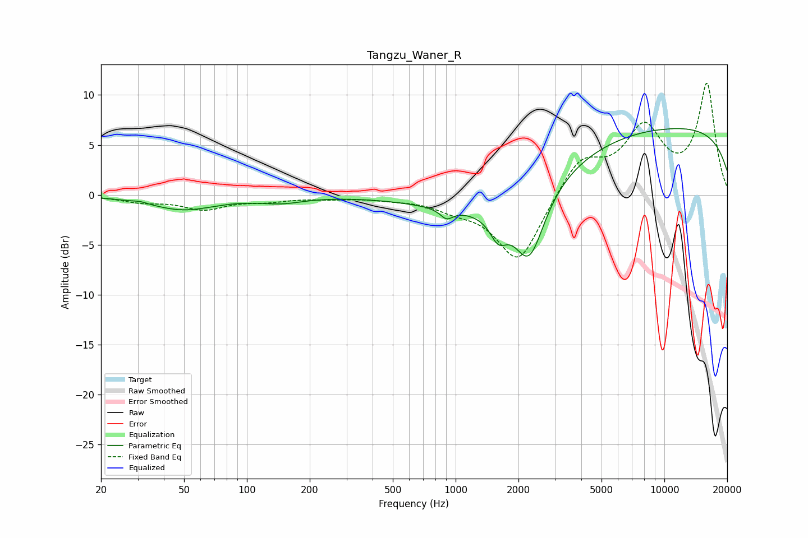

# Tangzu_Waner_R
See [usage instructions](https://github.com/jaakkopasanen/AutoEq#usage) for more options and info.

### Parametric EQs
Apply preamp of -6.7 dB when using parametric equalizer.

|   # | Type    |   Fc (Hz) |    Q |   Gain (dB) |
|-----|---------|-----------|------|-------------|
|   1 | Peaking |        31 | 4.43 |         0.2 |
|   2 | Peaking |        49 | 0.89 |        -1.5 |
|   3 | Peaking |       103 | 5.96 |        -0   |
|   4 | Peaking |       147 | 1.36 |        -0.6 |
|   5 | Peaking |       905 | 4.76 |        -0.9 |
|   6 | Peaking |      1602 | 3.48 |        -2.3 |
|   7 | Peaking |      1667 | 0.47 |        -2.7 |
|   8 | Peaking |      2255 | 1.95 |        -6.9 |
|   9 | Peaking |     10000 | 6    |        -0   |
|  10 | Peaking |     10000 | 0.18 |         6.9 |

### Fixed Band EQs
When using fixed band (also called graphic) equalizer, apply preamp of **-11.3 dB** (if available) and set gains manually with these parameters.

|   # | Type    |   Fc (Hz) |    Q |   Gain (dB) |
|-----|---------|-----------|------|-------------|
|   1 | Peaking |        31 | 1.41 |        -0.6 |
|   2 | Peaking |        62 | 1.41 |        -1.3 |
|   3 | Peaking |       125 | 1.41 |        -0.5 |
|   4 | Peaking |       250 | 1.41 |        -0.3 |
|   5 | Peaking |       500 | 1.41 |        -0.3 |
|   6 | Peaking |      1000 | 1.41 |        -1   |
|   7 | Peaking |      2000 | 1.41 |        -6.8 |
|   8 | Peaking |      4000 | 1.41 |         3.7 |
|   9 | Peaking |      8000 | 1.41 |         6.3 |
|  10 | Peaking |     16000 | 1.41 |        10.9 |

### Graphs

