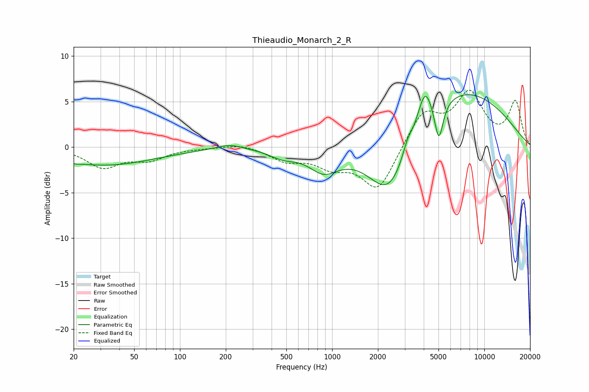

# Thieaudio_Monarch_2_R
See [usage instructions](https://github.com/jaakkopasanen/AutoEq#usage) for more options and info.

### Parametric EQs
Apply preamp of -5.9 dB when using parametric equalizer.

|   # | Type    |   Fc (Hz) |    Q |   Gain (dB) |
|-----|---------|-----------|------|-------------|
|   1 | Peaking |        20 | 4.01 |        -0.1 |
|   2 | Peaking |        32 | 0.43 |        -2   |
|   3 | Peaking |       212 | 1.65 |         0.6 |
|   4 | Peaking |       474 | 1.62 |        -0.9 |
|   5 | Peaking |       882 | 1.44 |        -2.4 |
|   6 | Peaking |      2387 | 0.99 |        -7.4 |
|   7 | Peaking |      3124 | 4.44 |         1.2 |
|   8 | Peaking |      4067 | 3.01 |         3.9 |
|   9 | Peaking |      5026 | 4.94 |        -4.4 |
|  10 | Peaking |      6627 | 0.37 |         6.6 |

### Fixed Band EQs
When using fixed band (also called graphic) equalizer, apply preamp of **-6.4 dB** (if available) and set gains manually with these parameters.

|   # | Type    |   Fc (Hz) |    Q |   Gain (dB) |
|-----|---------|-----------|------|-------------|
|   1 | Peaking |        31 | 1.41 |        -2.1 |
|   2 | Peaking |        62 | 1.41 |        -1.2 |
|   3 | Peaking |       125 | 1.41 |        -0.1 |
|   4 | Peaking |       250 | 1.41 |         0.4 |
|   5 | Peaking |       500 | 1.41 |        -1.4 |
|   6 | Peaking |      1000 | 1.41 |        -1.8 |
|   7 | Peaking |      2000 | 1.41 |        -4.8 |
|   8 | Peaking |      4000 | 1.41 |         3.8 |
|   9 | Peaking |      8000 | 1.41 |         5.6 |
|  10 | Peaking |     16000 | 1.41 |         4.9 |

### Graphs

