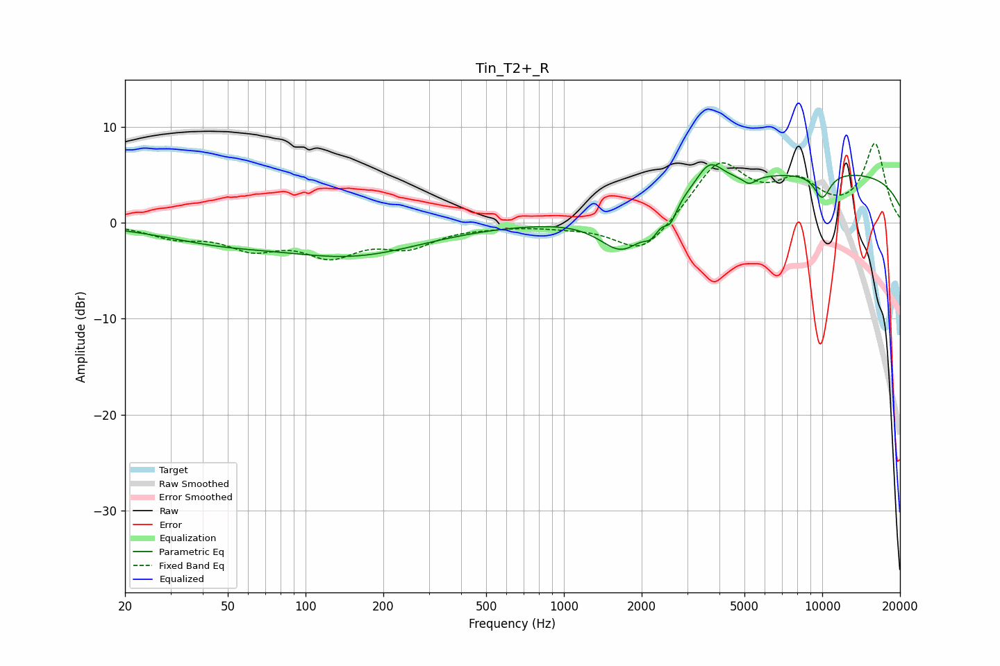

# Tin_T2+_R
See [usage instructions](https://github.com/jaakkopasanen/AutoEq#usage) for more options and info.

### Parametric EQs
Apply preamp of -6.1 dB when using parametric equalizer.

|   # | Type    |   Fc (Hz) |    Q |   Gain (dB) |
|-----|---------|-----------|------|-------------|
|   1 | Peaking |        46 | 0.62 |        -1.5 |
|   2 | Peaking |       153 | 0.51 |        -3.2 |
|   3 | Peaking |      1690 | 1.54 |        -4.5 |
|   4 | Peaking |      2178 | 4.62 |        -1.5 |
|   5 | Peaking |      2585 | 5.94 |        -1.7 |
|   6 | Peaking |      3659 | 2.79 |         2.7 |
|   7 | Peaking |      5220 | 5.29 |        -0.9 |
|   8 | Peaking |      9792 | 0.18 |         2.4 |
|   9 | Peaking |      9978 | 0.19 |         2.9 |
|  10 | Peaking |     10000 | 3.76 |        -2.7 |

### Fixed Band EQs
When using fixed band (also called graphic) equalizer, apply preamp of **-8.3 dB** (if available) and set gains manually with these parameters.

|   # | Type    |   Fc (Hz) |    Q |   Gain (dB) |
|-----|---------|-----------|------|-------------|
|   1 | Peaking |        31 | 1.41 |        -1.3 |
|   2 | Peaking |        62 | 1.41 |        -2.3 |
|   3 | Peaking |       125 | 1.41 |        -3   |
|   4 | Peaking |       250 | 1.41 |        -2.2 |
|   5 | Peaking |       500 | 1.41 |        -0.2 |
|   6 | Peaking |      1000 | 1.41 |        -0.3 |
|   7 | Peaking |      2000 | 1.41 |        -3.5 |
|   8 | Peaking |      4000 | 1.41 |         6.2 |
|   9 | Peaking |      8000 | 1.41 |         3.6 |
|  10 | Peaking |     16000 | 1.41 |         8.1 |

### Graphs

