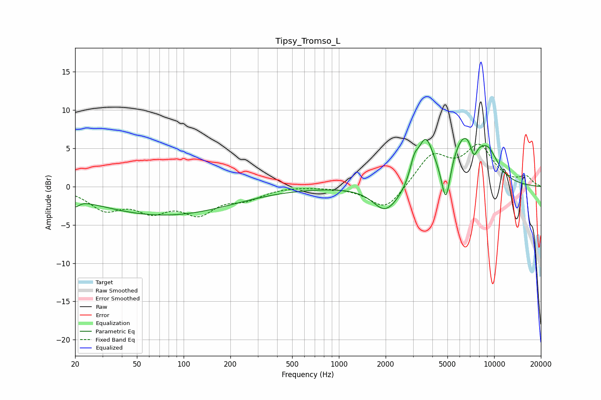

# Tipsy_Tromso_L
See [usage instructions](https://github.com/jaakkopasanen/AutoEq#usage) for more options and info.

### Parametric EQs
Apply preamp of -6.4 dB when using parametric equalizer.

|   # | Type    |   Fc (Hz) |    Q |   Gain (dB) |
|-----|---------|-----------|------|-------------|
|   1 | Peaking |        20 | 5.72 |        -1   |
|   2 | Peaking |        74 | 0.32 |        -3.7 |
|   3 | Peaking |      1967 | 1.82 |        -3   |
|   4 | Peaking |      2426 | 1.76 |        -0.9 |
|   5 | Peaking |      3054 | 5.45 |         2   |
|   6 | Peaking |      3613 | 2.75 |         5.6 |
|   7 | Peaking |      4888 | 4.89 |        -5.8 |
|   8 | Peaking |      6474 | 1.47 |         6.3 |
|   9 | Peaking |      7386 | 5.99 |        -2.2 |
|  10 | Peaking |      9184 | 1.93 |         3   |

### Fixed Band EQs
When using fixed band (also called graphic) equalizer, apply preamp of **-5.6 dB** (if available) and set gains manually with these parameters.

|   # | Type    |   Fc (Hz) |    Q |   Gain (dB) |
|-----|---------|-----------|------|-------------|
|   1 | Peaking |        31 | 1.41 |        -2.7 |
|   2 | Peaking |        62 | 1.41 |        -2.7 |
|   3 | Peaking |       125 | 1.41 |        -3.1 |
|   4 | Peaking |       250 | 1.41 |        -1.3 |
|   5 | Peaking |       500 | 1.41 |         0.1 |
|   6 | Peaking |      1000 | 1.41 |        -0   |
|   7 | Peaking |      2000 | 1.41 |        -3.2 |
|   8 | Peaking |      4000 | 1.41 |         4   |
|   9 | Peaking |      8000 | 1.41 |         5   |
|  10 | Peaking |     16000 | 1.41 |         1.2 |

### Graphs

