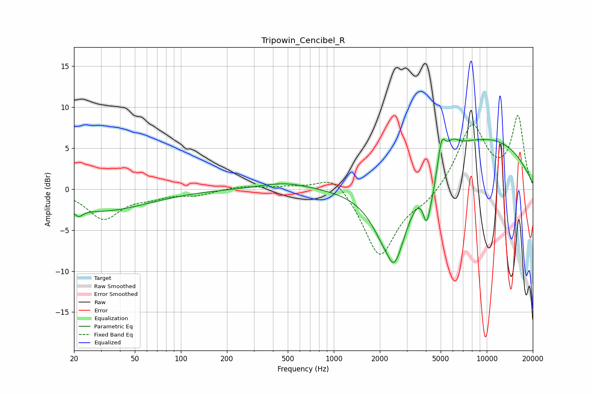

# Tripowin_Cencibel_R
See [usage instructions](https://github.com/jaakkopasanen/AutoEq#usage) for more options and info.

### Parametric EQs
Apply preamp of -6.2 dB when using parametric equalizer.

|   # | Type    |   Fc (Hz) |    Q |   Gain (dB) |
|-----|---------|-----------|------|-------------|
|   1 | Peaking |        21 | 5.03 |        -0.9 |
|   2 | Peaking |        30 | 0.46 |        -2.6 |
|   3 | Peaking |       478 | 0.87 |         0.8 |
|   4 | Peaking |      2256 | 3.99 |         1.2 |
|   5 | Peaking |      2421 | 1.49 |       -12.6 |
|   6 | Peaking |      4043 | 5.8  |        -4.1 |
|   7 | Peaking |      4414 | 4.22 |        -2.1 |
|   8 | Peaking |      5065 | 5.91 |         3.1 |
|   9 | Peaking |      5970 | 3.18 |         1.3 |
|  10 | Peaking |      8801 | 0.29 |         6.4 |

### Fixed Band EQs
When using fixed band (also called graphic) equalizer, apply preamp of **-9.1 dB** (if available) and set gains manually with these parameters.

|   # | Type    |   Fc (Hz) |    Q |   Gain (dB) |
|-----|---------|-----------|------|-------------|
|   1 | Peaking |        31 | 1.41 |        -3.5 |
|   2 | Peaking |        62 | 1.41 |        -0.7 |
|   3 | Peaking |       125 | 1.41 |        -0.6 |
|   4 | Peaking |       250 | 1.41 |         0.4 |
|   5 | Peaking |       500 | 1.41 |         0.3 |
|   6 | Peaking |      1000 | 1.41 |         2.2 |
|   7 | Peaking |      2000 | 1.41 |        -8.4 |
|   8 | Peaking |      4000 | 1.41 |        -1.4 |
|   9 | Peaking |      8000 | 1.41 |         7.8 |
|  10 | Peaking |     16000 | 1.41 |         8.7 |

### Graphs

