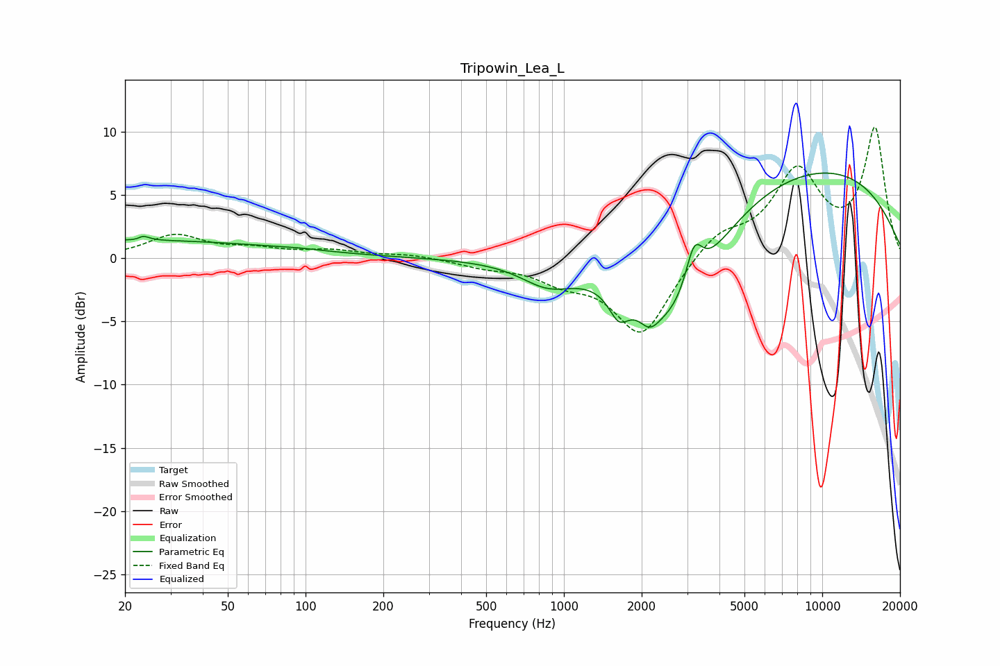

# Tripowin_Lea_L
See [usage instructions](https://github.com/jaakkopasanen/AutoEq#usage) for more options and info.

### Parametric EQs
Apply preamp of -6.8 dB when using parametric equalizer.

|   # | Type    |   Fc (Hz) |    Q |   Gain (dB) |
|-----|---------|-----------|------|-------------|
|   1 | Peaking |        20 | 0.21 |         1.4 |
|   2 | Peaking |        23 | 5.99 |        -1.3 |
|   3 | Peaking |        23 | 5.96 |         1.6 |
|   4 | Peaking |        95 | 1.58 |         0.1 |
|   5 | Peaking |       866 | 1.35 |        -1.8 |
|   6 | Peaking |      1632 | 3.61 |        -2.1 |
|   7 | Peaking |      2144 | 3.71 |        -1.3 |
|   8 | Peaking |      2631 | 0.84 |        -8.1 |
|   9 | Peaking |      3191 | 4.29 |         3.4 |
|  10 | Peaking |      8499 | 0.26 |         7.5 |

### Fixed Band EQs
When using fixed band (also called graphic) equalizer, apply preamp of **-10.4 dB** (if available) and set gains manually with these parameters.

|   # | Type    |   Fc (Hz) |    Q |   Gain (dB) |
|-----|---------|-----------|------|-------------|
|   1 | Peaking |        31 | 1.41 |         1.7 |
|   2 | Peaking |        62 | 1.41 |         0.6 |
|   3 | Peaking |       125 | 1.41 |         0.5 |
|   4 | Peaking |       250 | 1.41 |         0.3 |
|   5 | Peaking |       500 | 1.41 |        -0.6 |
|   6 | Peaking |      1000 | 1.41 |        -1.5 |
|   7 | Peaking |      2000 | 1.41 |        -6.1 |
|   8 | Peaking |      4000 | 1.41 |         2   |
|   9 | Peaking |      8000 | 1.41 |         6.6 |
|  10 | Peaking |     16000 | 1.41 |        10.1 |

### Graphs

