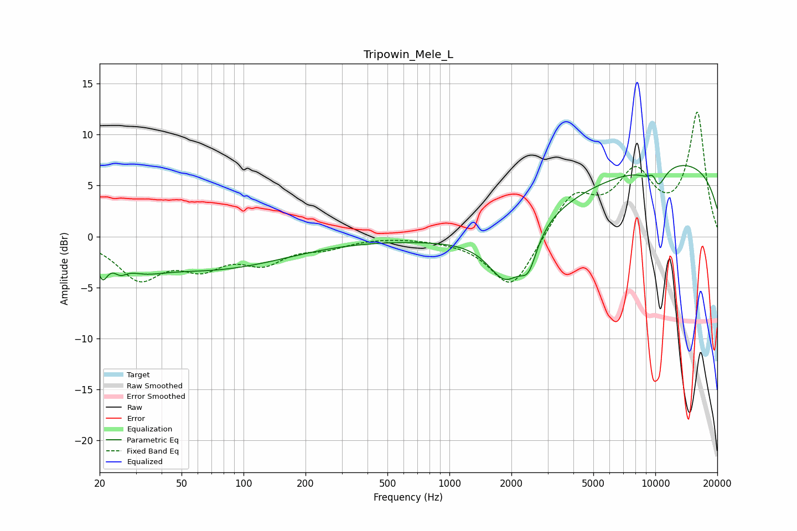

# Tripowin_Mele_L
See [usage instructions](https://github.com/jaakkopasanen/AutoEq#usage) for more options and info.

### Parametric EQs
Apply preamp of -7.1 dB when using parametric equalizer.

|   # | Type    |   Fc (Hz) |    Q |   Gain (dB) |
|-----|---------|-----------|------|-------------|
|   1 | Peaking |        21 | 5.85 |        -2.2 |
|   2 | Peaking |        25 | 4.71 |        -0.9 |
|   3 | Peaking |        32 | 1.4  |        -1.1 |
|   4 | Peaking |        67 | 0.37 |        -3.1 |
|   5 | Peaking |      1878 | 1.6  |        -5.1 |
|   6 | Peaking |      2424 | 3.52 |        -3   |
|   7 | Peaking |      2802 | 0.32 |        -2.1 |
|   8 | Peaking |      9799 | 4.72 |         3   |
|   9 | Peaking |      9889 | 0.18 |         7.9 |
|  10 | Peaking |     10000 | 3.19 |        -4.3 |

### Fixed Band EQs
When using fixed band (also called graphic) equalizer, apply preamp of **-12.3 dB** (if available) and set gains manually with these parameters.

|   # | Type    |   Fc (Hz) |    Q |   Gain (dB) |
|-----|---------|-----------|------|-------------|
|   1 | Peaking |        31 | 1.41 |        -3.9 |
|   2 | Peaking |        62 | 1.41 |        -2.5 |
|   3 | Peaking |       125 | 1.41 |        -2.2 |
|   4 | Peaking |       250 | 1.41 |        -0.9 |
|   5 | Peaking |       500 | 1.41 |         0.1 |
|   6 | Peaking |      1000 | 1.41 |        -0.2 |
|   7 | Peaking |      2000 | 1.41 |        -5.3 |
|   8 | Peaking |      4000 | 1.41 |         4.1 |
|   9 | Peaking |      8000 | 1.41 |         5.7 |
|  10 | Peaking |     16000 | 1.41 |        12   |

### Graphs

